<style>
  body { font-family: "Helvetica Neue", Helvetica, Arial, sans-serif; line-height: 1.6; color: #333; max-width: 860px; margin: 0 auto; }
  h1, h2, h3, h4 { color: #2c3e50; }
  h1 { border-bottom: 2px solid #3498db; padding-bottom: 10px; margin-top: 40px; }
  h2 { border-bottom: 1px solid #ecf0f1; padding-bottom: 5px; margin-top: 30px; }
  .cover-page { text-align: center; padding-top: 60px; page-break-after: always; }
  .cover-title { font-size: 48px; font-weight: bold; margin-bottom: 10px; color: #2c3e50; }
  .cover-subtitle { font-size: 22px; color: #7f8c8d; margin-top: 24px; margin-bottom: 40px; }
  .cover-version { font-size: 18px; color: #95a5a6; margin-top: 20px; }
  .page-break { page-break-after: always; }
  img { max-width: 100%; border: 1px solid #ddd; border-radius: 4px; box-shadow: 0 2px 5px rgba(0,0,0,0.1); margin: 16px 0; }
  img.inline { display: inline; margin: 4px; vertical-align: middle; box-shadow: none; border: none; }
  code { background-color: #f8f9fa; padding: 2px 5px; border-radius: 3px; font-family: monospace; font-size: 0.9em; }
  pre { background-color: #f8f9fa; padding: 15px; border-radius: 5px; overflow-x: auto; border: 1px solid #e9ecef; }
  blockquote { border-left: 4px solid #3498db; margin: 0 0 16px 0; padding: 10px 15px; color: #555; background: #ecf6fd; }
  table { width: 100%; border-collapse: collapse; margin: 20px 0; }
  th, td { border: 1px solid #ddd; padding: 10px 12px; text-align: left; }
  th { background-color: #f2f2f2; color: #333; font-weight: 600; }
  .note { background-color: #fff3cd; border: 1px solid #ffeeba; padding: 12px 16px; border-radius: 5px; color: #856404; margin: 20px 0; }
  .tip { background-color: #d4edda; border: 1px solid #c3e6cb; padding: 12px 16px; border-radius: 5px; color: #155724; margin: 20px 0; }
  .warning { background-color: #f8d7da; border: 1px solid #f5c6cb; padding: 12px 16px; border-radius: 5px; color: #721c24; margin: 20px 0; }
  ol li, ul li { margin-bottom: 6px; }
</style>

<div class="cover-page">
  
  <div class="cover-subtitle">The Modern Addon Manager for X-Plane 11 & 12</div>
  <div class="cover-version">Version 2.4.0 · User Manual</div>
  <div class="cover-version" style="margin-top:8px; font-size:14px;">February 2026</div>
</div>

---

## Table of Contents

1. [Introduction](#introduction)
2. [System Requirements](#system-requirements)
3. [Installation](#installation)
   - [Windows](#windows)
   - [macOS](#macos)
   - [Linux](#linux)
4. [First Launch & Initial Setup](#first-launch--initial-setup)
5. [Interface Overview](#interface-overview)
6. [Profiles](#profiles)
7. [Aircraft Manager](#aircraft-manager)
8. [Scenery Manager](#scenery-manager)
9. [World Map](#world-map)
10. [Plugins & CSLs](#plugins--csls)
11. [Flight Generator](#flight-generator)
12. [Utilities](#utilities)
13. [Issues Dashboard](#issues-dashboard)
14. [Settings](#settings)
15. [Troubleshooting](#troubleshooting)

<div class="page-break"></div>

# Introduction

**X-Addon-Oxide** is a native, high-performance addon manager for X-Plane 11 and 12. Built in Rust, it starts fast, runs light, and handles libraries of thousands of addons without slowdown. It replaces manual `scenery_packs.ini` editing with a visual, drag-and-drop interface backed by an AI heuristics engine (BitNet).

**Key Features at a Glance**

| Feature | Description |
|---|---|
| **Smart Sort** | AI-powered scenery ordering that enforces X-Plane's strict layer rules automatically |
| **Scenery Basket** | Temporary selection tool for bulk enable/disable/reorder operations |
| **Interactive Map** | World map showing your exact scenery coverage, health scores, and airport inspector |
| **Profiles** | Switch between multiple addon configurations (e.g. Summer, Winter, VATSIM) instantly |
| **Aircraft Installer** | Drag a zip archive in; it extracts to the right folder with a progress bar |
| **Flight Generator** | Natural-language flight plans with live METAR weather, time-of-day filtering, and four export formats |
| **FlyWithLua Scripts** | Enable/disable individual Lua scripts without touching plugin files |
| **Issues Dashboard** | Scans `Log.txt` for missing assets, DSF errors, and scenery order violations |
| **Companion Apps** | Launch SimBrief, Navigraph, Little NavMap, vPilot, and more from one place |
| **Export Lists** | Export your scenery or aircraft library to CSV or XML for documentation |

<div class="page-break"></div>

# System Requirements

## Minimum Requirements (all platforms)

| Component | Minimum |
|---|---|
| CPU | 64-bit dual-core, 2 GHz |
| RAM | 4 GB |
| Disk | 200 MB free (for app and METAR cache) |
| Display | 1280 × 720 |
| Network | Optional — required for live METAR weather in Flight Generator |

## Windows

| Requirement | Version |
|---|---|
| Operating System | Windows 10 (64-bit) or later |
| Visual C++ Runtime | Included in installer |
| .NET | Not required |

## macOS

| Requirement | Version |
|---|---|
| Operating System | macOS 11 Big Sur or later |
| Architecture | Intel x86-64 and Apple Silicon (arm64) both supported |

## Linux

| Requirement | Details |
|---|---|
| Operating System | Any modern 64-bit distro (glibc ≥ 2.31) |
| Display | X11 or Wayland |
| Required libraries | `alsa-lib`, `fontconfig`, `wayland`, `libX11`, `libxkbcommon`, `dbus`, `gtk3` |

**Install libraries on your distro:**

```bash
# Ubuntu / Debian
sudo apt-get install -y libasound2-dev libfontconfig1-dev libwayland-dev \
  libx11-dev libxkbcommon-dev libdbus-1-dev libgtk-3-dev

# Arch Linux
sudo pacman -S alsa-lib fontconfig wayland libx11 libxkbcommon dbus gtk3

# Fedora
sudo dnf install alsa-lib-devel fontconfig-devel wayland-devel libX11-devel \
  libxkbcommon-devel dbus-devel gtk3-devel

# openSUSE
sudo zypper install alsa-devel fontconfig-devel wayland-devel libX11-devel \
  libxkbcommon-devel dbus-1-devel gtk3-devel
```

<div class="page-break"></div>

# Installation

## Windows

1. Download the `.exe` installer from the [Releases](https://github.com/StarTux/X-Addon-Oxide/releases) page.
2. Double-click the installer and follow the NSIS setup wizard.
3. Accept the default install location (`C:\Program Files\X-Addon-Oxide\`) or choose your own.
4. A Start Menu shortcut and optional Desktop shortcut are created automatically.
5. Launch **X-Addon-Oxide** from the Start Menu.

<div class="note">
<strong>Windows Defender / Antivirus:</strong> On first launch, Windows may scan the executable. If your antivirus slows the initial scenery scan (especially on large libraries), see <a href="#windows-1">Windows Troubleshooting</a> for the recommended exclusion path.
</div>

## macOS

1. Download the `.dmg` disk image from the Releases page.
2. Open the DMG and drag **X-Addon-Oxide** to your **Applications** folder.
3. On first launch, right-click the app and choose **Open** to bypass Gatekeeper on the first run.
4. Grant any permission prompts (filesystem access to your X-Plane folder).

<div class="note">
<strong>macOS Gatekeeper:</strong> Because the app is distributed outside the Mac App Store, macOS will warn you on first launch. Right-click → Open resolves this permanently for future launches.
</div>

## Linux

### AppImage (recommended — no installation required)

1. Download `X-Addon-Oxide-x86_64.AppImage` from the Releases page.
2. Make it executable:
   ```bash
   chmod +x X-Addon-Oxide-x86_64.AppImage
   ```
3. Run it:
   ```bash
   ./X-Addon-Oxide-x86_64.AppImage
   ```

### DEB Package (Ubuntu / Debian)

```bash
sudo dpkg -i x-addon-oxide_2.4.0_amd64.deb
# Then launch from your application menu or:
x-addon-oxide
```

### RPM Package (Fedora / openSUSE)

```bash
sudo rpm -i x-addon-oxide-2.4.0.x86_64.rpm
```

<div class="page-break"></div>

# First Launch & Initial Setup

On first launch, X-Addon-Oxide displays its loading screen while it synchronises with your X-Plane installation.

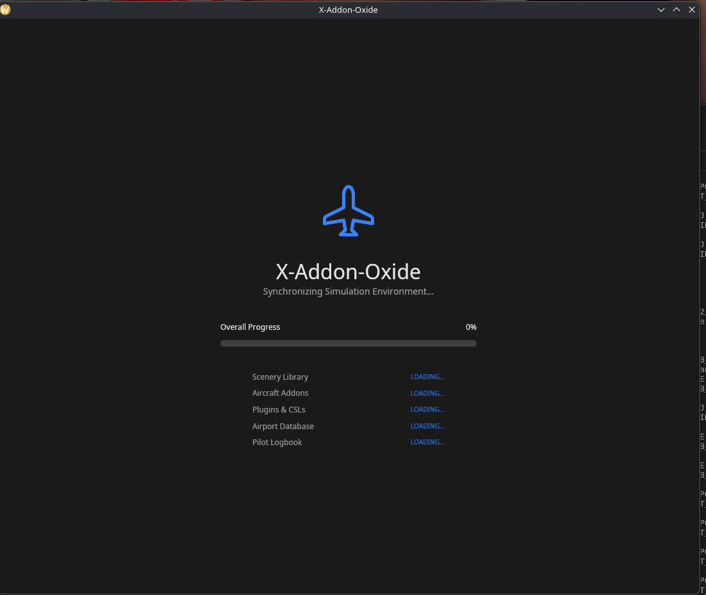

The loader initialises five subsystems simultaneously:

| Subsystem | What it loads |
|---|---|
| Scenery Library | Reads `scenery_packs.ini` and scans `Custom Scenery/` |
| Aircraft Addons | Scans the `Aircraft/` folder tree |
| Plugins & CSLs | Scans `Resources/plugins/` |
| Airport Database | Builds the global 38,000-airport index for Flight Generator |
| Pilot Logbook | Parses `Output/logbooks/Pilot.txt` |

## Setting Your X-Plane Root

If auto-detection fails (or you have multiple X-Plane installations), set the root manually:

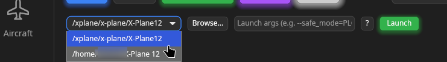

1. Click the **path dropdown** in the top toolbar (shows your current X-Plane path).
2. Select an existing detected install, or click **Browse…** to locate your X-Plane folder manually.
3. The app reloads all data from the newly selected installation immediately.

<div class="tip">
<strong>Multiple Installations:</strong> X-Addon-Oxide fully supports switching between X-Plane 11 and X-Plane 12 installations. Each installation has its own isolated config so profiles, pins, and tags don't bleed between installs.
</div>

<div class="page-break"></div>

# Interface Overview

The top toolbar is present on every tab and provides quick access to the most common actions.

**Aircraft tab toolbar:**

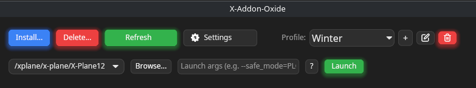

**Scenery tab toolbar:**

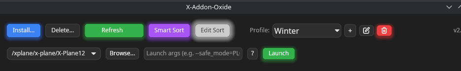

| Control | Function |
|---|---|
| **Install…** | Install an aircraft or scenery pack from a zip archive |
| **Delete…** | Permanently delete a selected addon from disk |
| **Refresh** | Re-scan all addons (use after external changes) |
| **Smart Sort** | Automatically order scenery by X-Plane loading rules |
| **Edit Sort** | Manual pin editor (text-based) |
| **Settings** | Open the Settings tab |
| **Profile** dropdown | Switch between saved hangar profiles |
| **+** | Create a new profile |
| Pencil / Trash | Rename or delete the current profile |
| **X-Plane path** dropdown | Switch between installed X-Plane versions |
| **Browse…** | Locate X-Plane root manually |
| **Launch args** | Command-line arguments passed to X-Plane on launch |
| **Launch** | Start X-Plane directly from X-Addon-Oxide |

**Tab navigation** (left sidebar):

| Tab | Purpose |
|---|---|
| Aircraft | Hangar management, install, enable/disable, icons |
| Scenery | Scenery order, smart sort, basket, tagging, export |
| Plugins | Plugin and FlyWithLua script management |
| CSLs | Online traffic model libraries |
| Flight Gen | Natural-language flight plan generator |
| Utilities | Companion Apps and Pilot Logbook |
| Issues | X-Plane Log.txt error analyser |
| Settings | App-wide configuration |

<div class="page-break"></div>

# Profiles

Profiles let you maintain multiple addon configurations for the same X-Plane installation — for example a **Default** profile (everything on) and a **Winter** profile (winter mesh only, summer airports disabled).

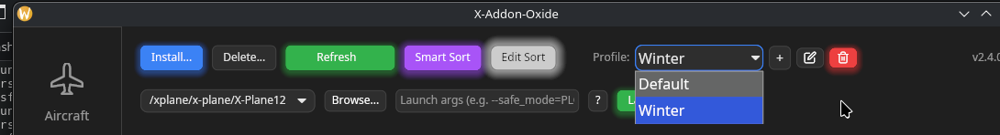

## Managing Profiles

| Action | How |
|---|---|
| **Switch** | Click the Profile dropdown and select a name |
| **Create** | Click **+** next to the dropdown |
| **Rename** | Click the pencil icon |
| **Delete** | Click the trash icon (cannot delete the last profile) |

Switching profiles immediately rewrites your `scenery_packs.ini` to reflect the selected configuration. Each profile independently tracks which packs are enabled, disabled, or pinned.

<div class="tip">
<strong>Tip:</strong> Create a <em>Performance</em> profile that disables all orthophoto mesh packs for faster X-Plane loading when you just want a quick flight.
</div>

<div class="page-break"></div>

# Aircraft Manager

The **Aircraft** tab gives you complete control over your `Aircraft/` folder. Everything is organised in a collapsible folder tree.

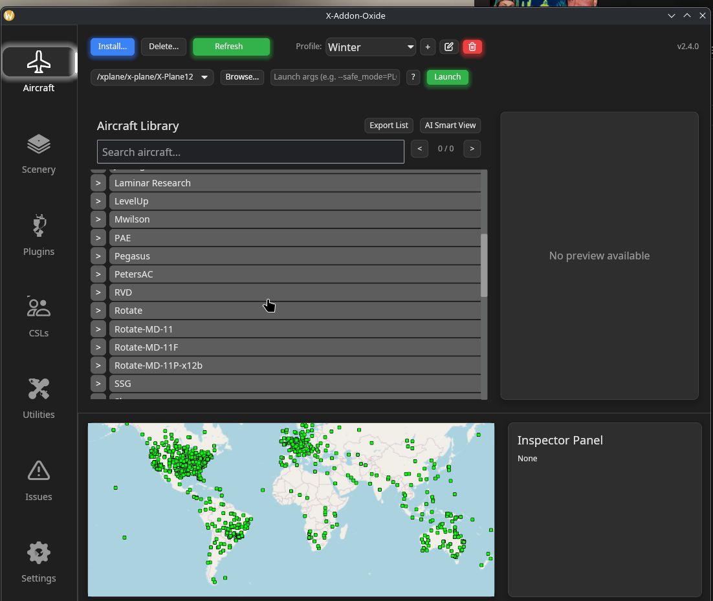

## Installing Aircraft

You can install aircraft directly from a zip archive without leaving the app.

1. Click **Install…** in the top toolbar.

   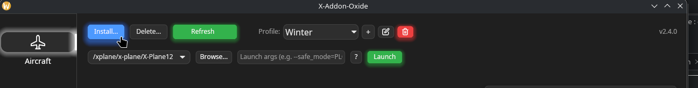

2. A file browser opens — select the zip archive for the aircraft you want to install.

   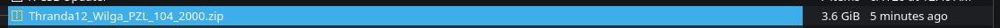

3. Choose the destination folder inside `Aircraft/` where the pack will be extracted.

   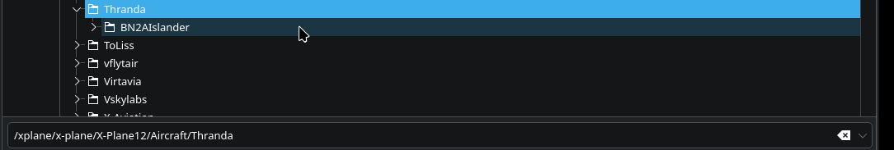

4. Extraction begins with a live progress bar. Large archives (3+ GB) show percentage completion.

   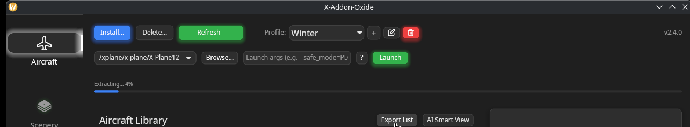

5. When complete, click **Refresh** — the new aircraft appears in the library.

   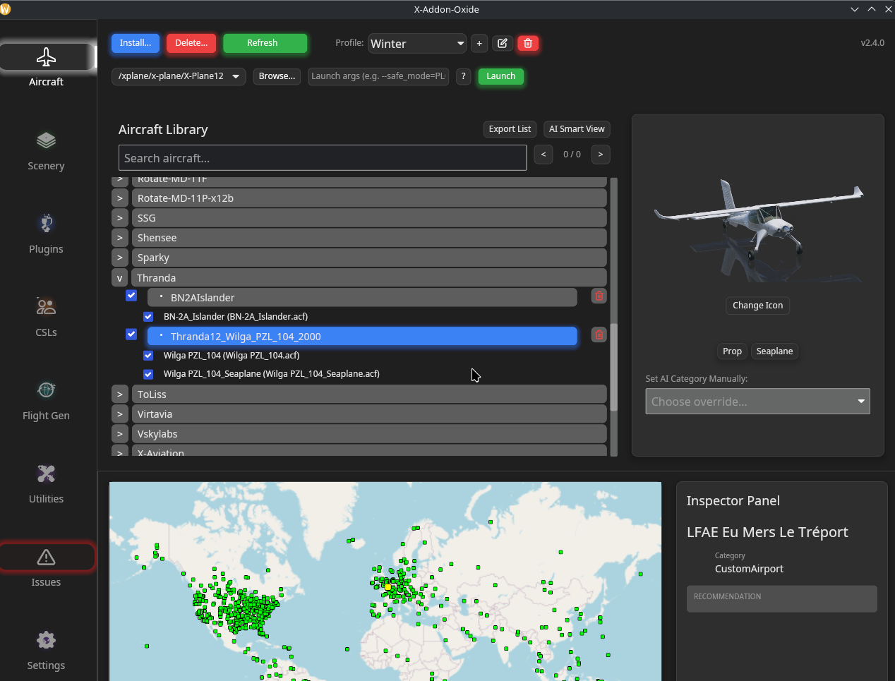

## Disabling Aircraft

Disabled aircraft are still on disk but hidden from X-Plane's aircraft selector. X-Addon-Oxide moves the folder to an `(Disabled)` sub-folder — no files are deleted.

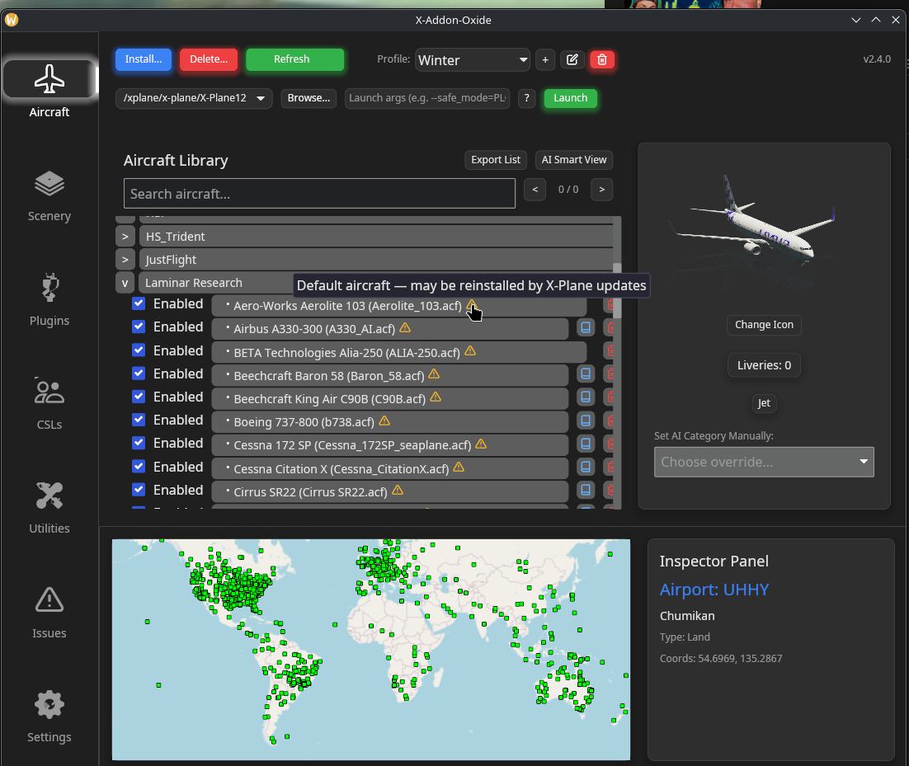

Click the checkbox or toggle next to any aircraft to enable or disable it. The status updates immediately.

<div class="note">
<strong>Note:</strong> X-Plane may flag disabled aircraft as "may be removed" in its own UI. This is cosmetic — the files remain intact and can be re-enabled from X-Addon-Oxide at any time.
</div>

## Searching Aircraft

Use the **Search aircraft…** bar at the top of the library to filter by name or manufacturer. The folder tree stays collapsed and only matching entries appear.

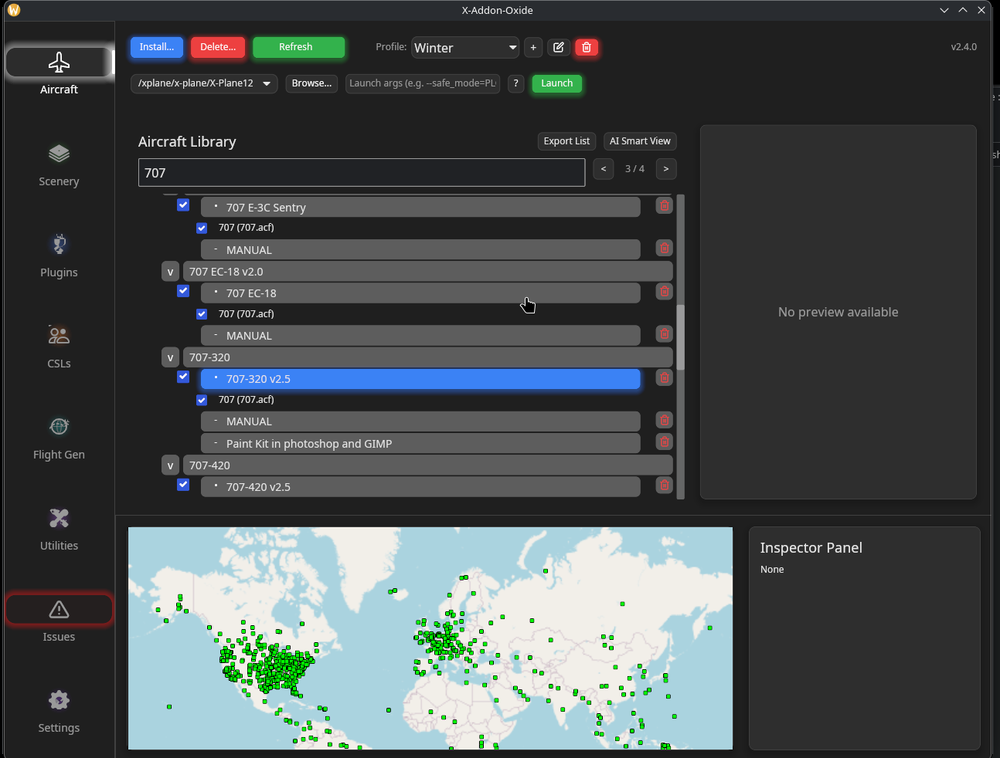

Results appear as an expandable tree — the folder name is the parent and individual `.acf` variants are children. Click **▶** to expand any folder and see all liveries and variant files.

## Exporting Your Aircraft List

Click **Export List** to save a catalogue of your entire aircraft library.

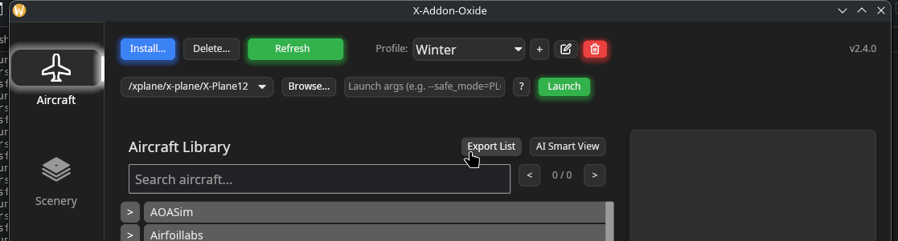

A file-save dialog appears with three format options:

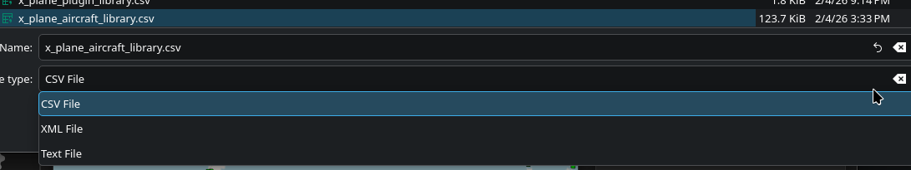

| Format | Best for |
|---|---|
| **CSV** | Spreadsheet analysis in Excel or LibreOffice |
| **XML** | Structured data / scripting |
| **Text File** | Quick plain-text inventory |

The exported CSV includes aircraft name, `.acf` path, category, and enabled status.

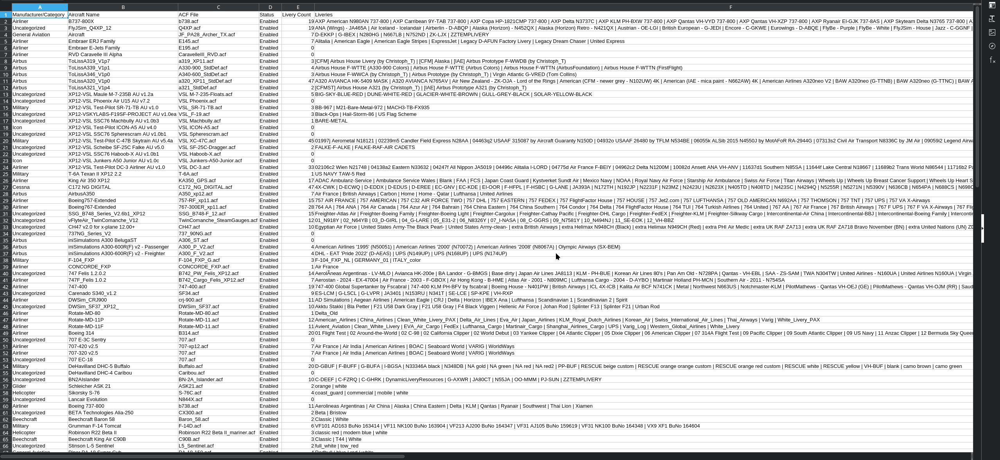

## AI Smart View

Toggle **AI Smart View** to automatically categorise your aircraft by type using the BitNet heuristics engine.

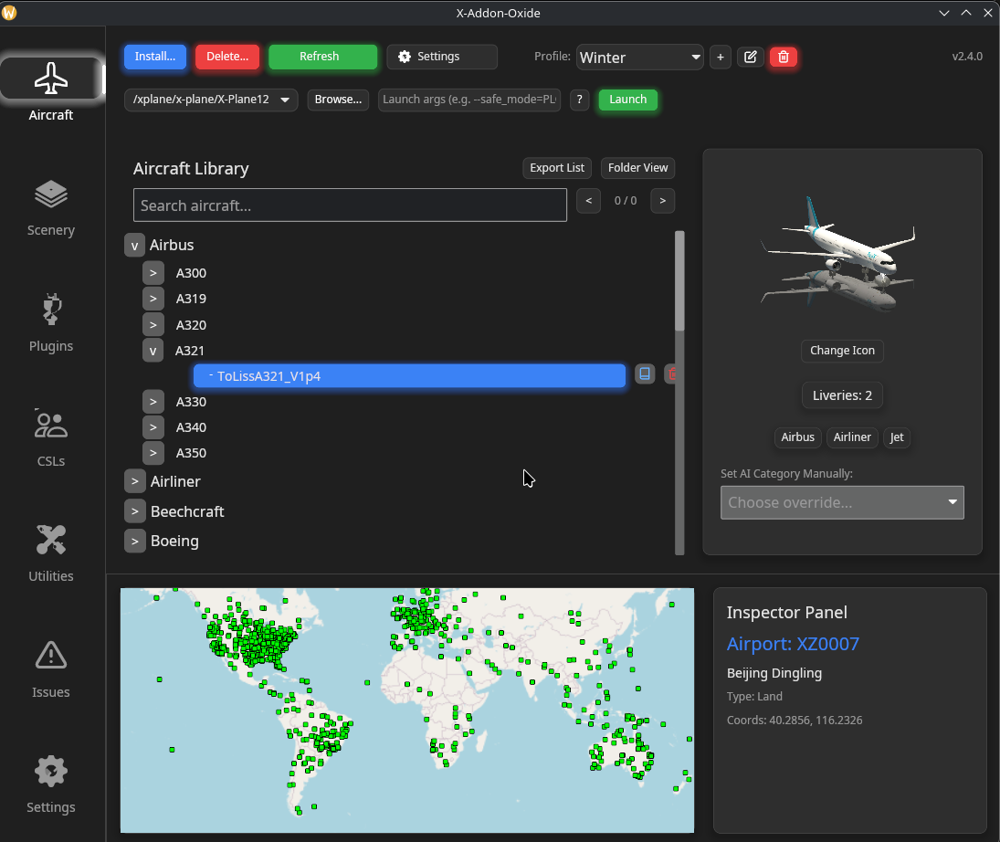

If an aircraft is placed in the wrong category, select it and use **Set Category** in the Inspector Panel. Your choice is saved and applied to future refreshes.

## Custom Icons

Personalise your hangar with a custom icon for any aircraft.

1. Select the aircraft in the list.
2. Click **Change Icon** in the Inspector Panel.

   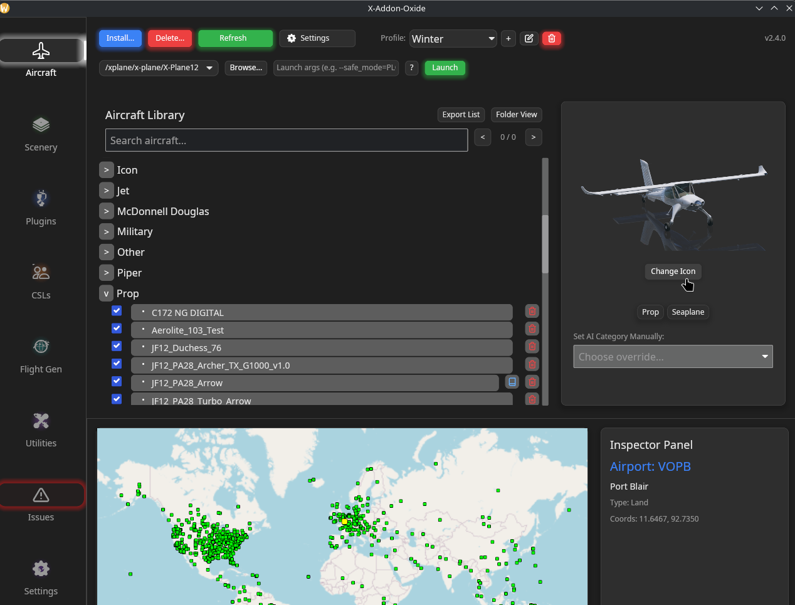

3. A file chooser opens. Navigate to any `.png` or `.jpg` image — you can use the aircraft's own livery thumbnail.

   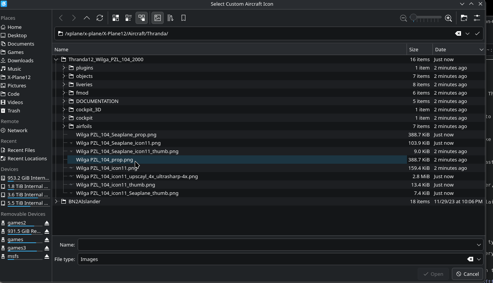

4. The icon updates instantly.

   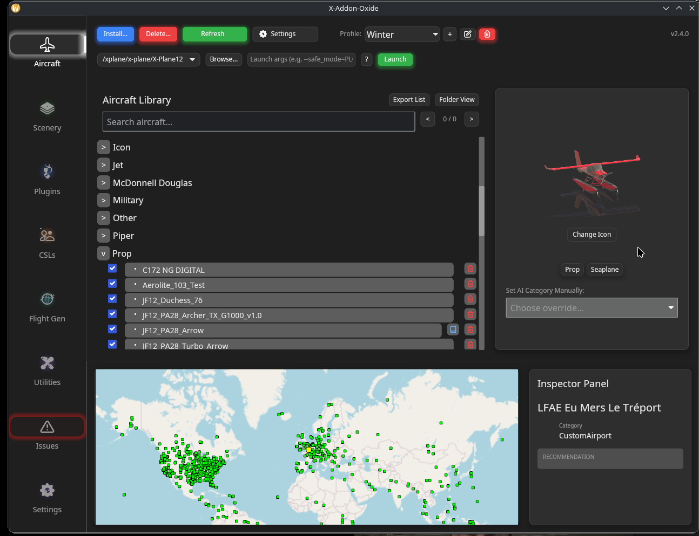

## PDF Manuals

If an aircraft includes a `manuals/` folder with PDF files, a **Book** icon (📖) appears next to its name.

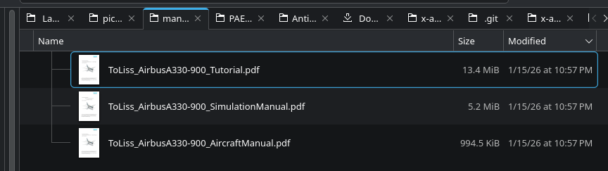

* Clicking the icon opens the PDF directly in your system's default viewer.
* If multiple PDFs are found, the `manuals/` folder opens instead so you can choose.

<div class="page-break"></div>

# Scenery Manager

The **Scenery** tab is the heart of X-Addon-Oxide. It manages `scenery_packs.ini` — the file X-Plane reads to determine which scenery packs load and in what order.

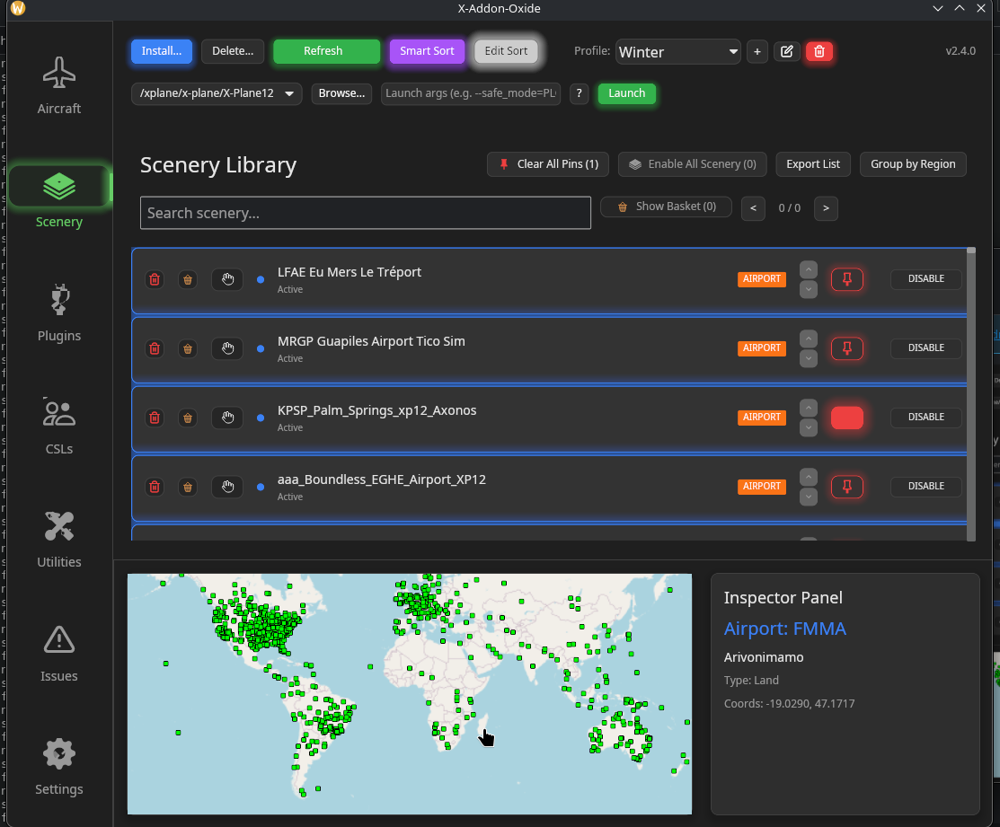

## Understanding the Scenery List

Each row in the Scenery Library represents one entry in `scenery_packs.ini`. The order from top to bottom is the exact order X-Plane loads them — items at the top take priority over items below.

**Row controls (left to right):**

| Control | Function |
|---|---|
| Red trash icon | Delete pack from disk permanently |
| Orange basket icon | Add/remove from Scenery Basket |
| Drag handle (⠿) | Drag to reorder manually |
| Blue dot / grey dot | Enabled (blue) or disabled (grey) |
| Pack name + status | Name and Active/Disabled indicator |
| Category badge | Auto-detected type (AIRPORT, MESH, OVERLAY…) |
| Tag badges | Your custom tags with × remove buttons |
| Up/Down arrows | Move one position up or down |
| Pin icon | Pinned status — pinned packs are respected by Smart Sort |
| DISABLE / ENABLE | Toggle pack on or off in the INI |

## Searching Scenery

Type in the **Search scenery…** bar to filter instantly by pack name or ICAO code.

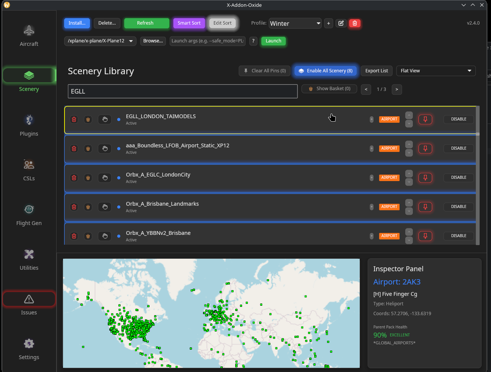

All pack types that match appear — airports, mesh, overlays, and libraries — making it easy to find a specific addon in a library of hundreds.

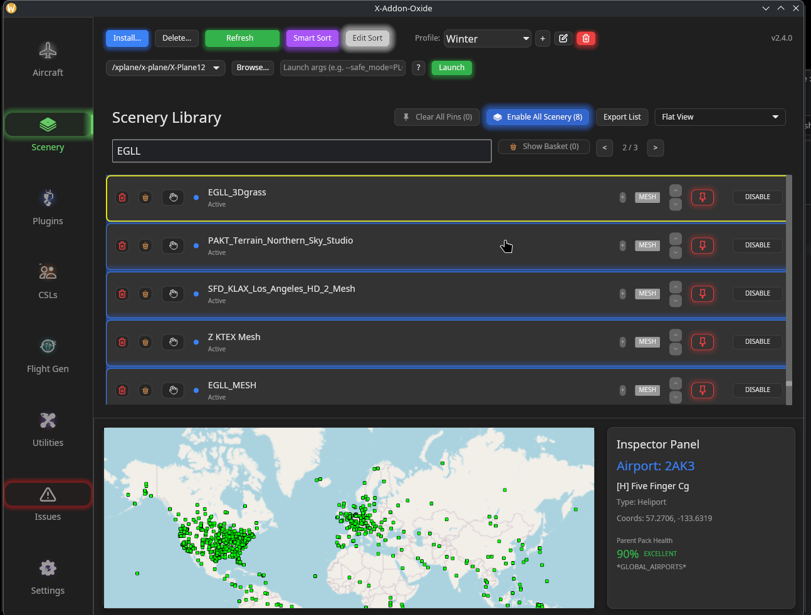

## Enabling and Disabling Scenery

Disabled packs are flagged with `SCENERY_PACK_DISABLED` in `scenery_packs.ini`. X-Plane skips them at startup. No files are moved or deleted.

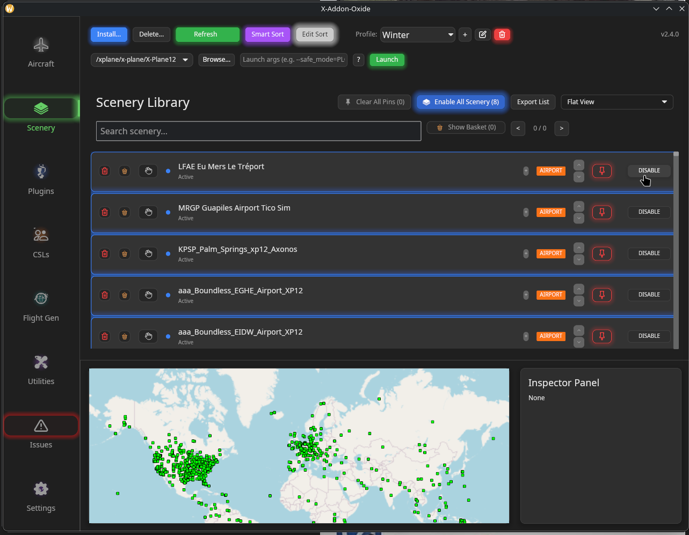

Click **DISABLE** on any active pack. The status line beneath the name changes to *Disabled*, and the INI entry updates immediately:

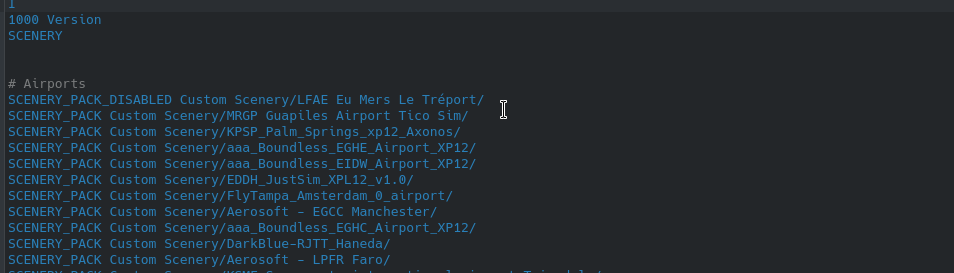

To re-enable, click **ENABLE** — the button appears on any disabled row:

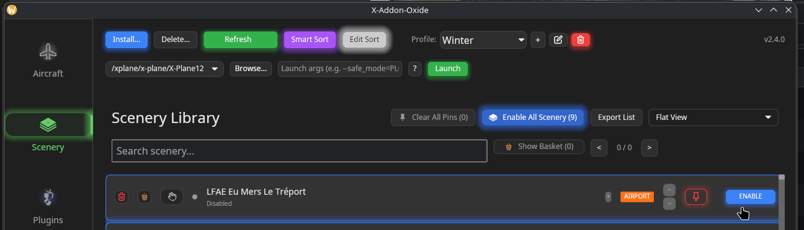

The INI reverts to a normal `SCENERY_PACK` line:

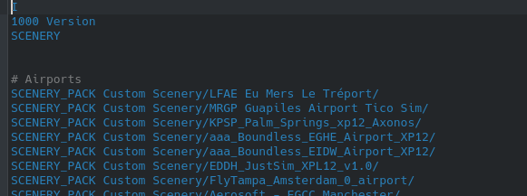

<div class="note">
<strong>Note:</strong> The <strong>Enable All Scenery</strong> button at the top of the library re-enables every disabled pack in one click — useful after switching profiles.
</div>

## Drag-and-Drop Reordering

Grab the grip handle (⠿) on the left edge of any row and drag it to a new position.

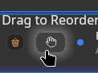


A ghost overlay shows the pack being moved. A gap indicator shows exactly where it will land. When you release, the change is written to `scenery_packs.ini` immediately — no Apply button needed.

Manually moved packs are automatically **pinned** (red pin icon). Smart Sort will not move pinned packs in future runs, preserving your manual arrangement.

## Smart Sort

Click **Smart Sort** to let the BitNet engine automatically order your entire library according to X-Plane's loading rules. A **Smart Sort Simulation Report** appears before any changes are made.

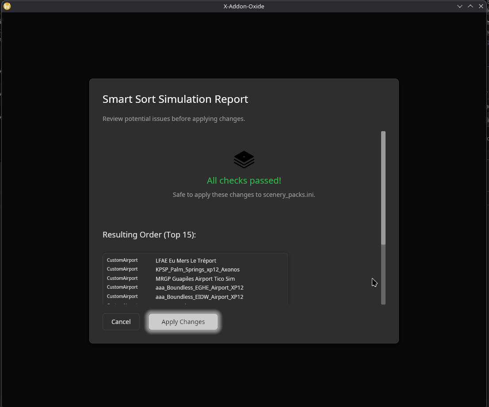

The report shows:
* A **pass / fail** status with a list of any detected ordering issues.
* A preview of the **Top 15 packs** in the resulting order.

Click **Apply Changes** to write the new order, or **Cancel** to discard.

### How Smart Sort Orders Scenery

Smart Sort uses category scores to assign each pack a priority tier:

| Tier | Category | Examples |
|---|---|---|
| 1 | Custom Airports | Hand-crafted airport payware |
| 2 | Custom Landmarks | City overlays, 3D buildings |
| 3 | Orthophoto Overlays | Detailed ground textures |
| 4 | Global Airports | X-Plane's built-in `*GLOBAL_AIRPORTS*` |
| 5 | Libraries | Object libraries (e.g. OpenSceneryX) |
| 6 | Mesh / Terrain | Elevation mesh (e.g. SimHeaven HD Mesh) |

> **The Golden Rule:** Global Airports **must** load above SimHeaven / X-World mesh packs. If SimHeaven loads first, its exclusion zones hide the default airport terminals, leaving empty aprons. Smart Sort enforces this automatically.

### Edit Sort

Click **Edit Sort** for a text-based editor where you can manually adjust priority scores, create pin rules, and fine-tune sort behaviour beyond what the GUI exposes.


## Pinning

Any pack can be pinned to lock its position against future Smart Sorts. Dragging a pack manually auto-pins it. To clear all pins, click **Clear All Pins (n)** at the top of the library.

## Deleting Scenery

To permanently remove a pack from disk, click the **red trash icon** on the left of the row.

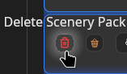

<div class="warning">
<strong>Warning:</strong> Deletion is permanent and cannot be undone. The pack folder is removed from disk entirely. Use <strong>Disable</strong> if you may want the pack back.
</div>

## Scenery Basket

The Scenery Basket is a temporary holding area for collecting packs you want to act on as a group — bulk enable/disable, reorder, or inspect.

### Adding to the Basket

**Method 1 — Click the basket icon:**

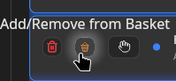

Click the orange basket icon on any row to add it to the basket. Click again to remove it.

**Method 2 — Drag into the basket:**

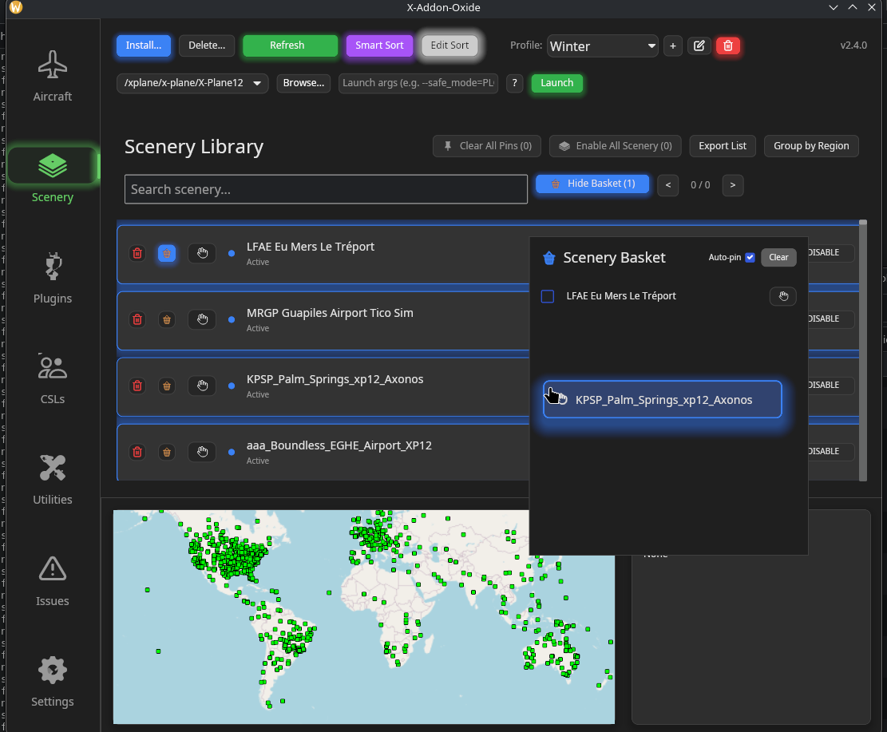

Open the basket panel, then drag a row directly into it.

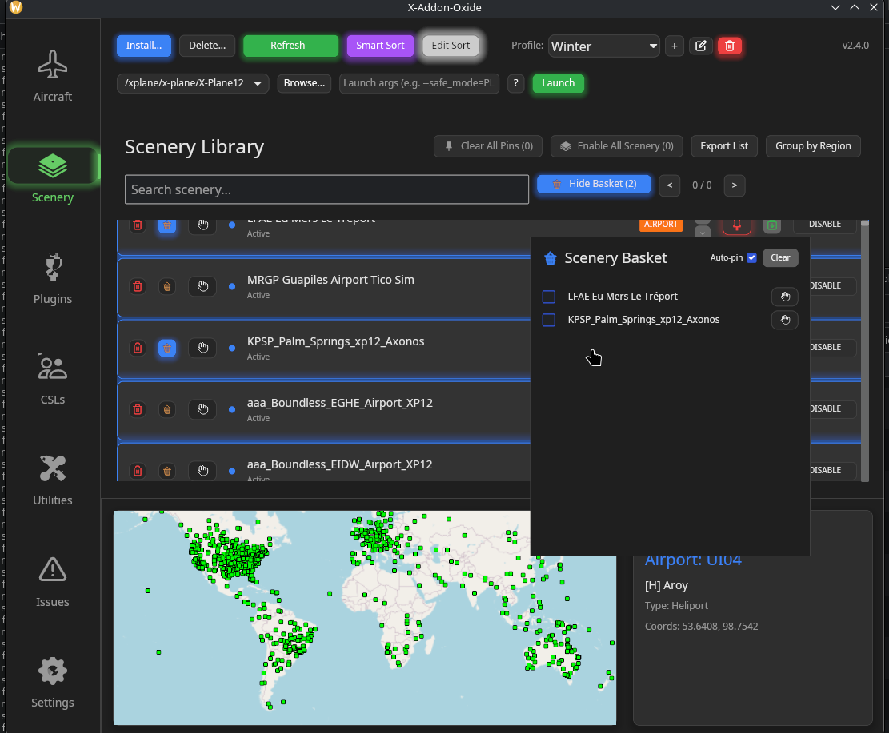

### Opening the Basket

Once you have at least one item in the basket, the **Show Basket (n)** button appears in the toolbar area. Click it to open the basket panel.

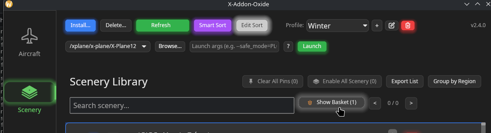

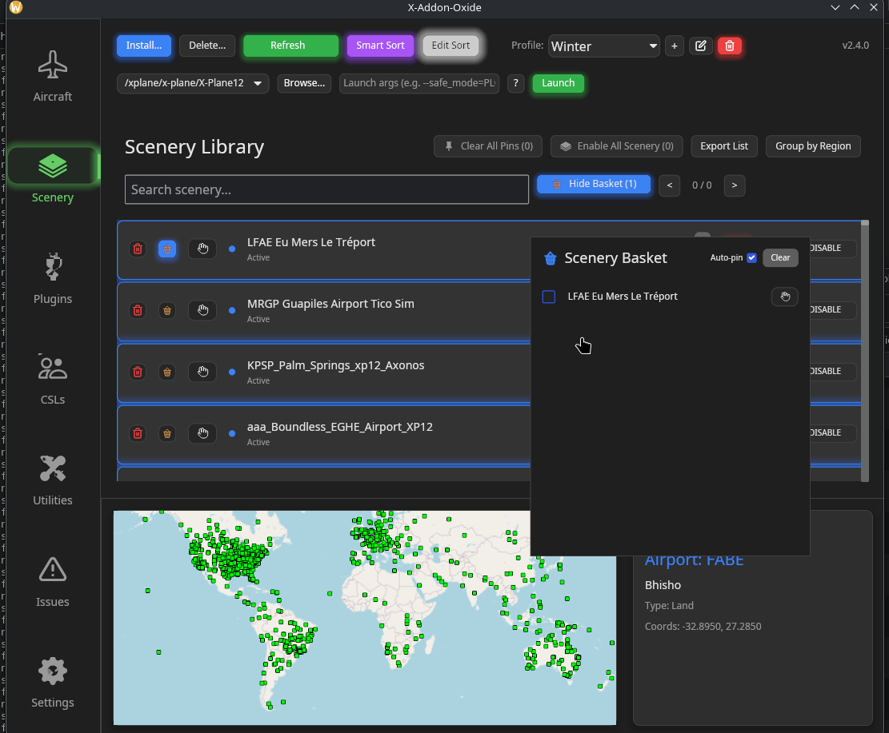

The basket panel slides in from the right. It shows all selected packs with:
* **Auto-pin** toggle — automatically pins each pack after a basket operation.
* **Clear** — empties the basket.
* Individual remove buttons per item.

### Bulk Operations

With packs in the basket, bulk action buttons appear:

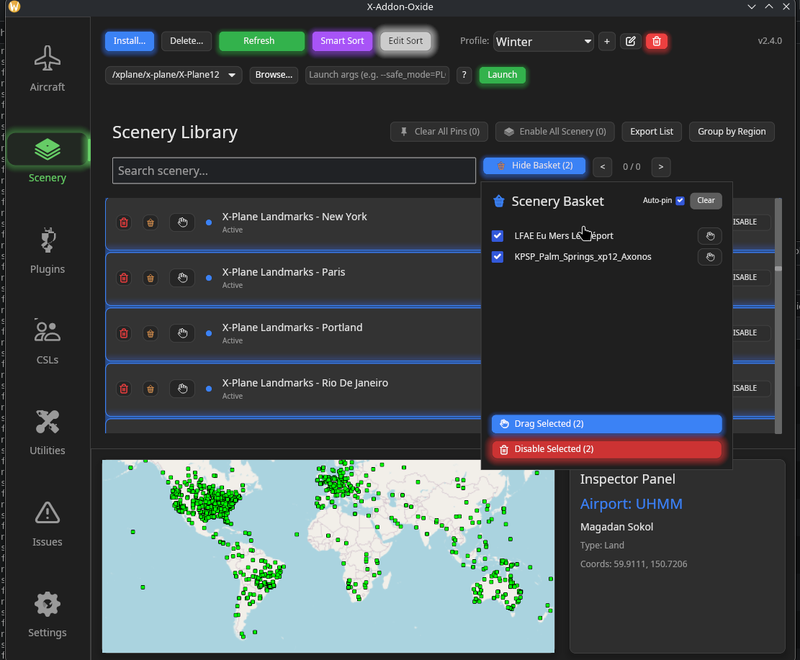

| Button | Condition | Effect |
|---|---|---|
| **Disable Selected** (red) | All basket packs are enabled | Disables every pack in the basket |
| **Enable Selected** (blue) | All basket packs are disabled | Enables every pack in the basket |
| **Toggle Selected** (purple) | Mixed enabled/disabled | Flips each pack to its opposite state |

<div class="tip">
<strong>Tip:</strong> Use the basket to build a set of "summer airports" and another for "winter airports", then bulk-toggle between them rather than creating full profiles.
</div>

## Tagging Scenery

Assign custom text tags to any pack for your own organisation system.

**Adding a tag:**

1. Click the **+** tag button on any row.

   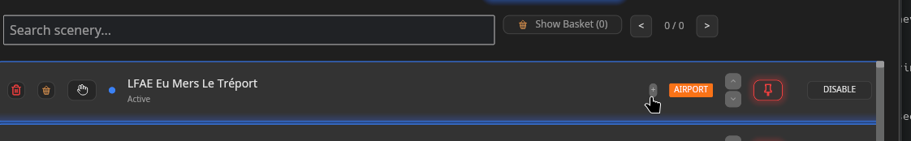

2. Type the tag name in the input field that appears inline.

   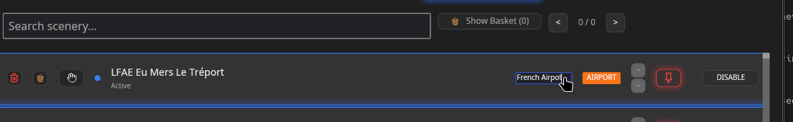

3. Press **Enter** to apply. The tag badge appears on the row, with an **×** to remove it.

   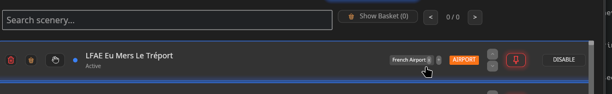

## View Modes

The **view dropdown** (top-right of the Scenery Library) switches how packs are grouped:

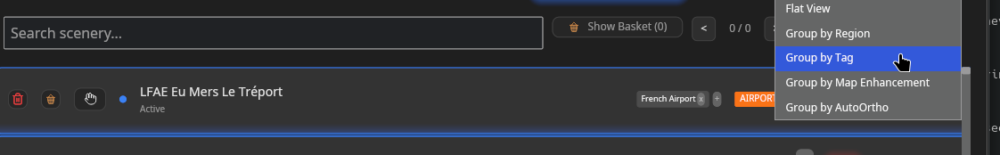

| Mode | Description |
|---|---|
| **Flat View** | All packs in one list — the actual `scenery_packs.ini` loading order |
| **Group by Region** | Packs organised by geographic continent |
| **Group by Tag** | Packs grouped under your custom tag labels |
| **Group by Map Enhancement** | Separates ortho, mesh, and overlay packs |
| **Group by AutoOrtho** | Groups AutoOrtho tile sets together |

### Group by Tag

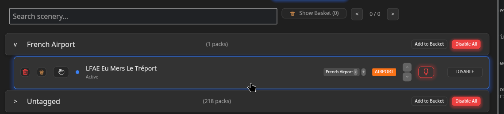

Each tag becomes a collapsible group header showing its pack count. Untagged packs collect under **Untagged**. Each group has **Add to Bucket** and **Disable All** actions for quick bulk operations.

### Group by Region

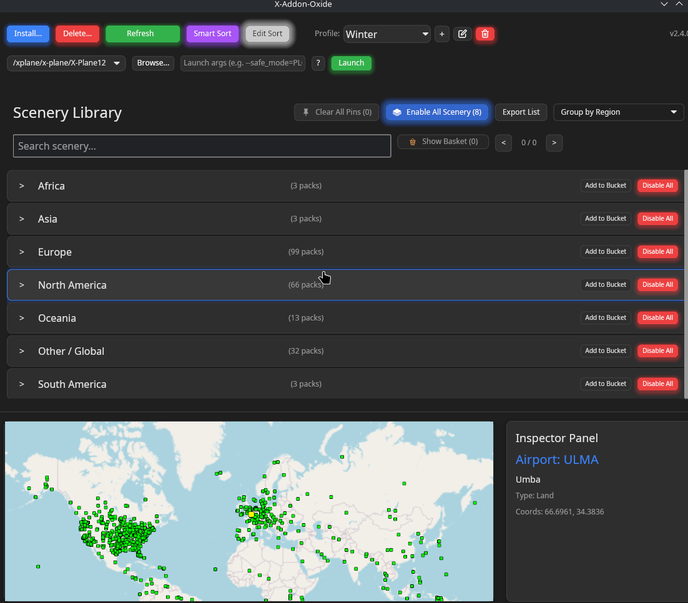

Packs are assigned to a continent based on their airport GPS coordinates. Each continent group shows pack count and supports **Add to Bucket** and **Disable All**.

### Group by AutoOrtho

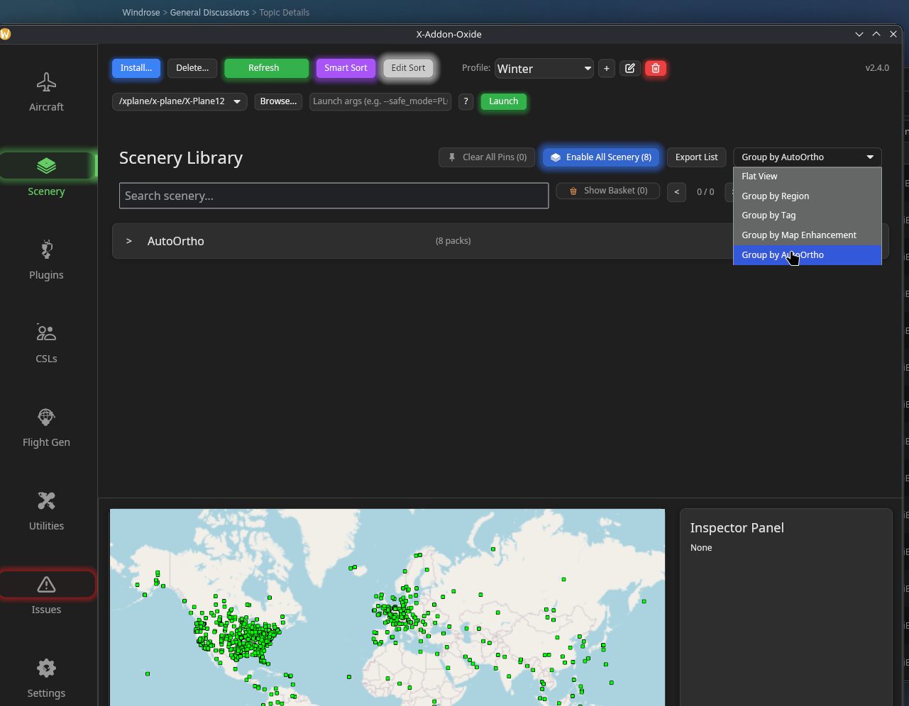

Detects and groups AutoOrtho tile sets automatically, making it easy to disable the entire AutoOrtho layer for a VFR-only session.

## Exporting Your Scenery List

Click **Export List** to save a snapshot of your entire scenery library.

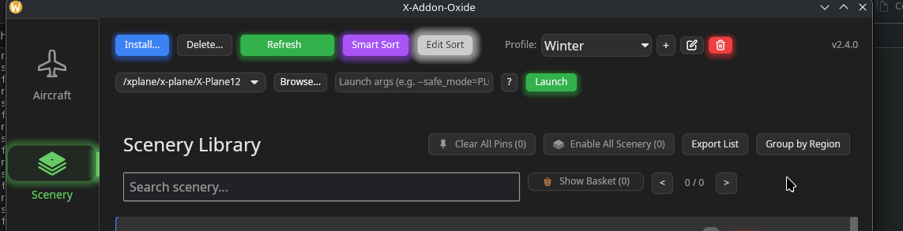

A file-save dialog opens with format options:

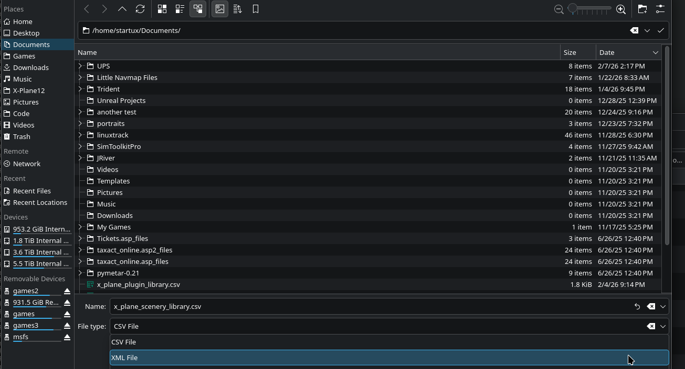

| Format | Contains |
|---|---|
| **CSV** | Pack name, path, category, region, enabled status, ICAO codes |
| **XML** | Structured hierarchy for use in scripts or documentation |

**CSV example (LibreOffice):**

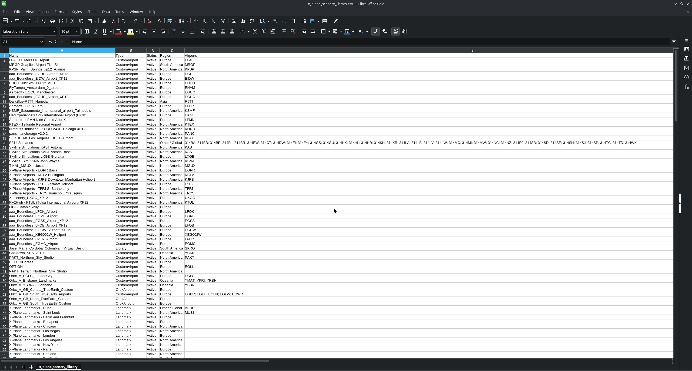

**XML example:**

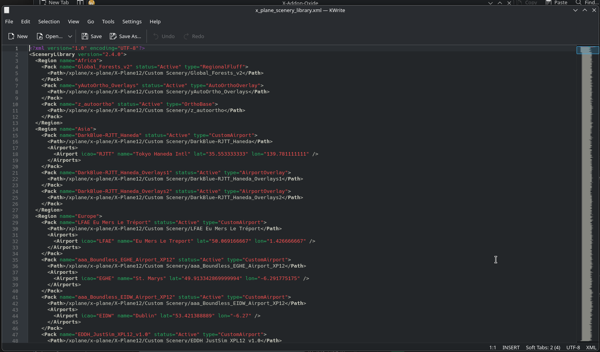

<div class="page-break"></div>

# World Map

The interactive map at the bottom of the screen visualises your entire installed scenery coverage.

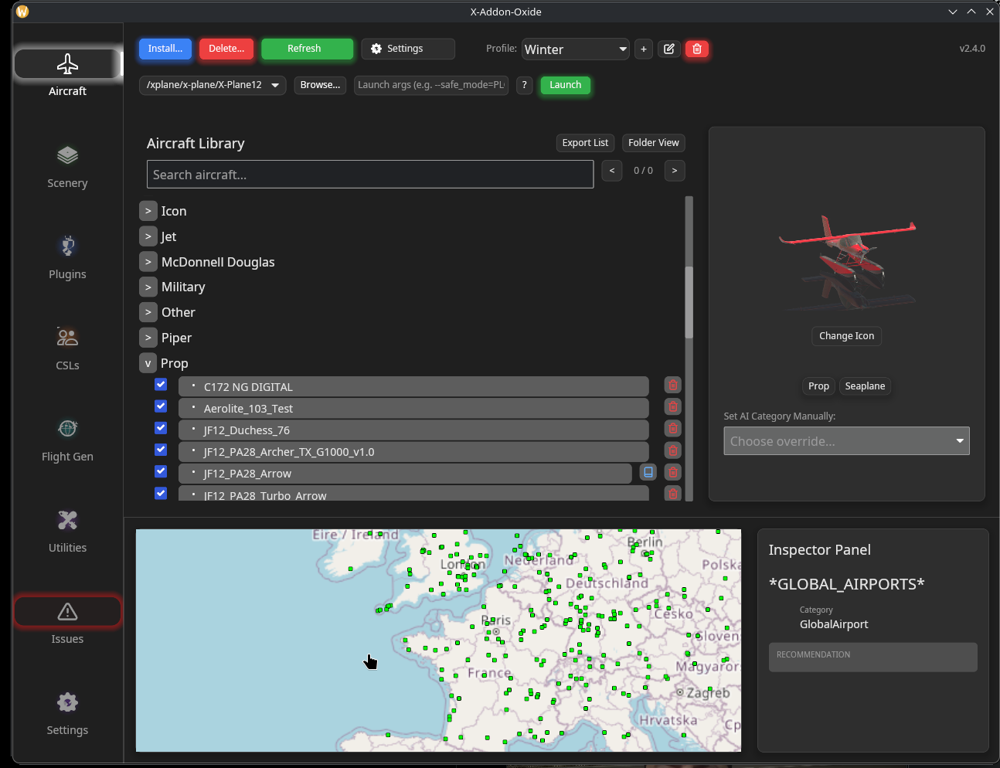

## Reading the Map

| Marker | Meaning |
|---|---|
| Green dot | Custom airport from your installed scenery packs |
| Cyan / blue tile | Orthophoto or mesh coverage tile |
| Grey dot | Global Airports (built-in X-Plane) |

**Inspector Panel:** Click any dot or tile to see details — ICAO code, airport name, type, GPS coordinates, parent pack name, and health score.

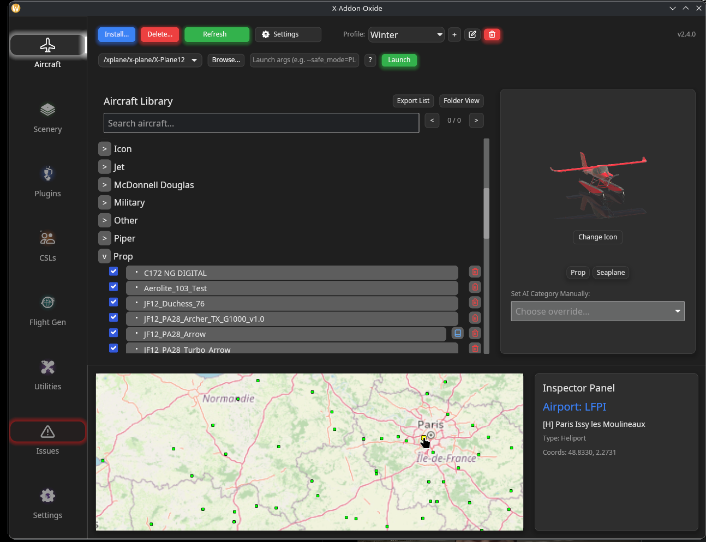

## Zoom and Pan

* **Scroll wheel** — zoom in/out.
* **Click-drag** — pan the map.
* At higher zoom levels, OpenStreetMap base tiles load to show roads and terrain context.

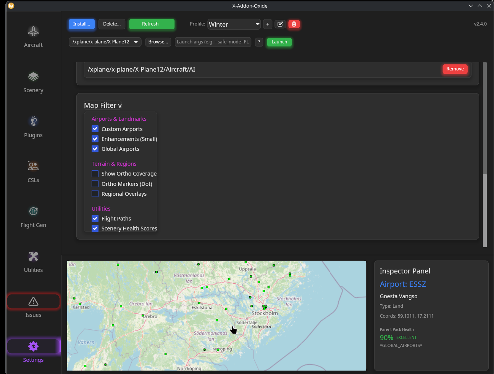

## Map Filters

Click **Map Filter ▾** to control which layers are visible:

| Filter | Shows |
|---|---|
| Custom Airports | Your installed airport pack dots |
| Enhancements (Small) | Overlay and enhancement scenery |
| Global Airports | Built-in X-Plane airport markers |
| Show Ortho Coverage | Orthophoto tile footprints |
| OrthoMasters (Grid) | Grid lines for ortho tile sets |
| Regional Overlays | Regional mesh footprints |
| Flight Paths | Logbook route tracks from the Logbook tab |
| Scenery Health Scores | Colour-coded airport health overlay |

## Scenery Health Scores

Enable **Scenery Health Scores** in the filter to colour-code each airport dot by structural completeness:

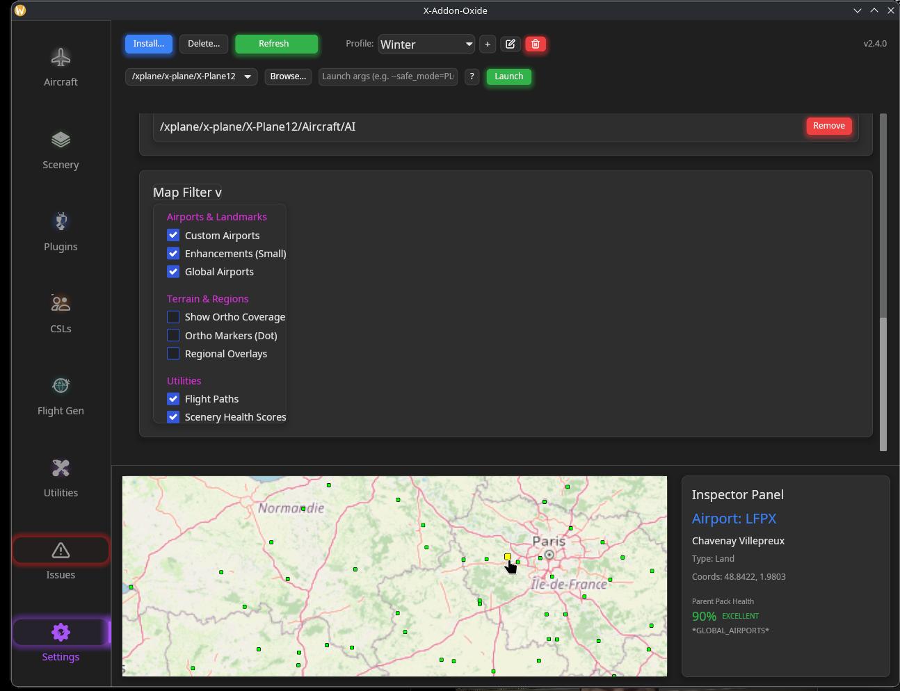

| Colour | Score | Meaning |
|---|---|---|
| Green | 80–100% (Excellent) | All expected files present (apt.dat, DSF objects) |
| Orange | 50–79% (Fair) | Some expected files missing |
| Red | 0–49% (Poor) | Critical files absent — pack may not work |

<div class="page-break"></div>

# Plugins & CSLs

## Plugin Management

The **Plugins** tab lists everything in `Resources/plugins/`. Use the checkbox on any row to enable or disable a plugin. Disabled plugins are moved to a `(disabled)` sub-folder — no files are ever deleted.

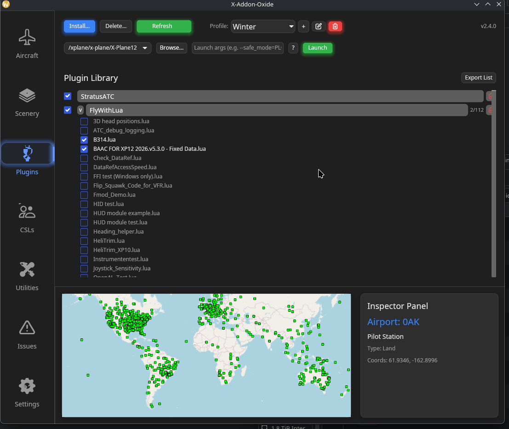

## FlyWithLua Script Management

If you use **FlyWithLua**, X-Addon-Oxide discovers every `.lua` script inside its `Scripts/` and `Scripts (disabled)/` sub-folders and shows them as expandable children under the FlyWithLua row.

* Click **▶** on the FlyWithLua row to expand the script list.
* The badge (e.g. `2/12`) shows how many scripts are currently enabled out of total found.
* Check or uncheck individual scripts — enabled scripts live in `Scripts/`, disabled ones move to `Scripts (disabled)/`.
* The plugin itself is unaffected; only the individual script files are toggled.

<div class="tip">
<strong>Tip:</strong> Keep development scripts (test utilities, debug tools) in FlyWithLua but disable them for normal flying. Re-enable them in seconds when you need them.
</div>

## CSL Libraries

For online flying (VATSIM / IVAO), CSL (Common Shape Library) packages provide traffic model rendering. The **CSLs** tab lists all detected CSL packages and lets you toggle them individually.

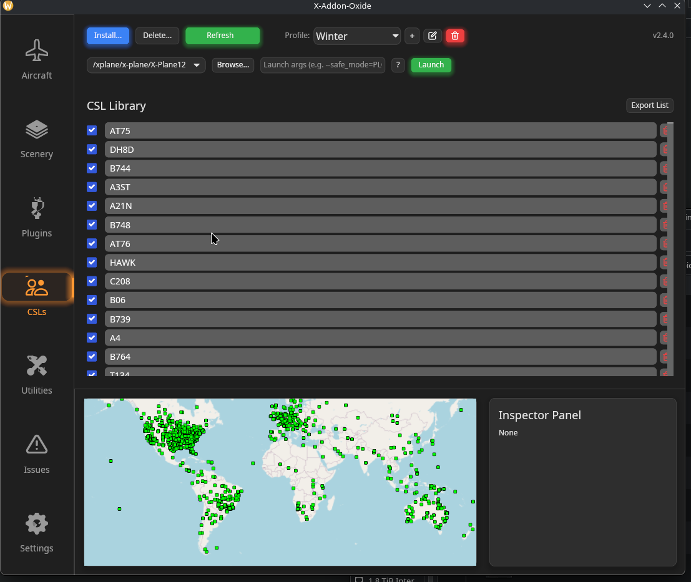

<div class="page-break"></div>

# Flight Generator

The **Flight Gen** tab generates complete flight plans from natural-language text prompts. It uses a global airport database (~38,000 airports) and — when an internet connection is available — live METAR data from NOAA for real-time weather filtering.

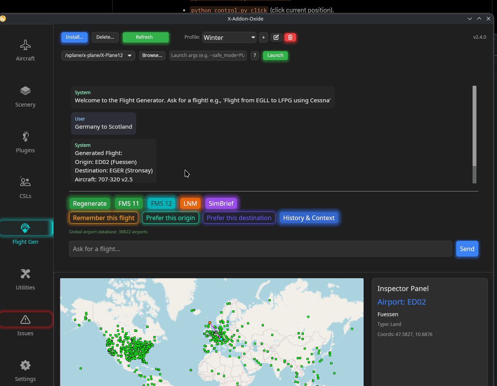

## Writing a Prompt

Type your request into **Ask for a flight…** and press **Send** or **Enter**. Be as specific or as vague as you like:

```
London to Paris in a 737
One hour flight at dawn
Bush flight in Alaska with a floatplane
Flight from KLAX to KSFO with an Airbus
Storm flight in Europe for 2 hours
```

The engine extracts the following from your text:

| Element | Examples |
|---|---|
| **Origin** | ICAO code, city name, country, region, or omit for random |
| **Destination** | Same as origin — can differ in specificity |
| **Aircraft** | Manufacturer, model name, category (helicopter, jet, turboprop…) |
| **Duration** | `short`, `1 hour`, `45 minutes`, `long haul`, `transatlantic` |
| **Time of day** | `dawn`, `daytime`, `afternoon`, `sunset`, `night` |
| **Weather** | `storm`, `clear`, `fog`, `snow`, `gusty`, `calm`, `rain` |
| **Surface** | `grass`, `gravel`, `water` / `seaplane` / `floatplane`, `paved` |
| **Flight type** | `bush`, `backcountry`, `regional` |

### Time-of-Day Filtering

When you specify a time like `daytime` or `at dawn`, the engine calculates the current local solar time at each candidate airport and only selects airports where the sun is in the correct position **right now**.

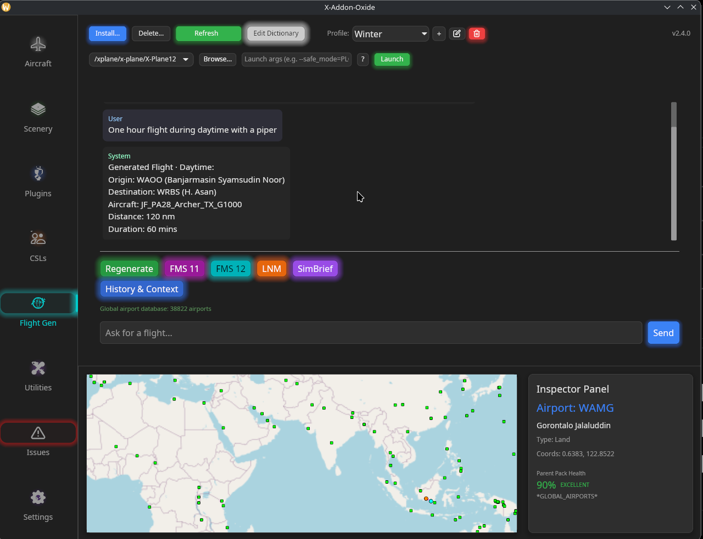

### Weather Filtering

Weather prompts trigger live METAR lookup. The engine downloads a real-time global METAR cache from NOAA (~38,000 stations) and only selects airports where the actual reported conditions match your request.

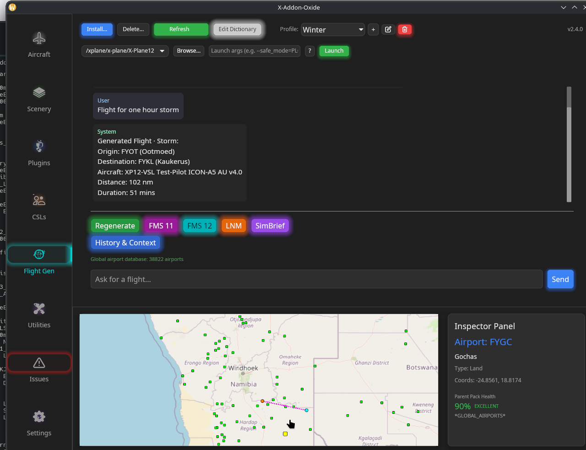

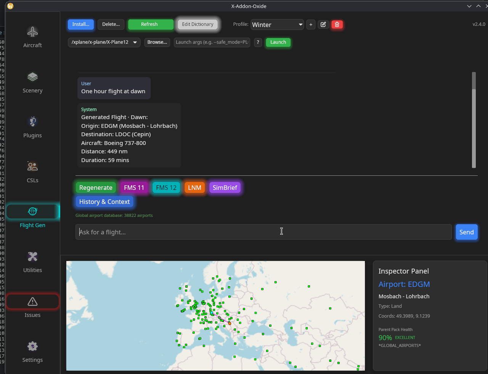

<div class="note">
<strong>Weather not showing?</strong> If the selected airport has no METAR station (small strips, remote airports), the weather label is omitted from the result. The flight is still valid — just unverified by live data.
</div>

## Regenerate

Click **Regenerate** to get a different airport pair for the same prompt without retyping. Each press picks fresh random candidates from the airport pool. Use it if the first result is not what you had in mind geographically.

## Export Formats

After generation, four export buttons appear below the result:

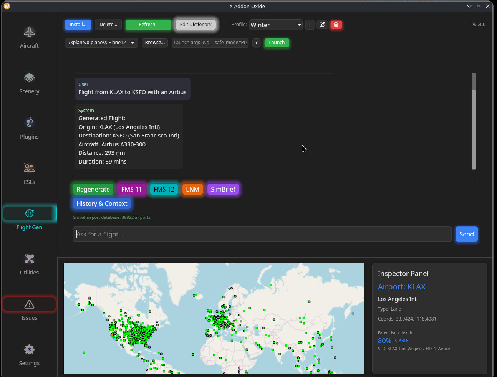

| Button | Format | Use with |
|---|---|---|
| **FMS 11** | X-Plane 11 `.fms` | X-Plane 11 built-in FMS, G1000 |
| **FMS 12** | X-Plane 12 `.fms` | X-Plane 12 FMS, Toliss, Zibo 737, IXEG |
| **LNM** | Little NavMap `.lnmpln` | Little NavMap for route planning and briefing |
| **SimBrief** | Opens SimBrief website | Full OFP dispatch briefing |

### FMS 12 — Step-by-Step

1. Click **FMS 12**. A system save dialog opens, pre-navigated to `Output/FMS plans/`.

   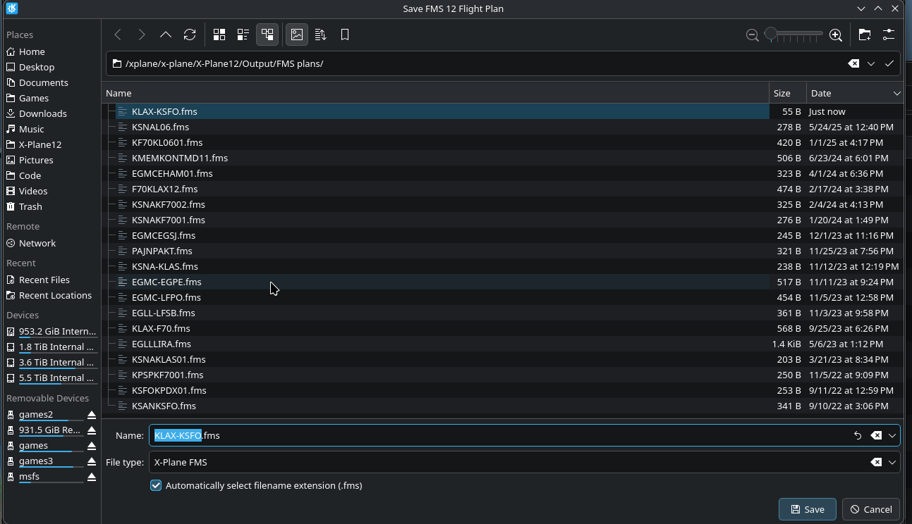

2. The filename is pre-filled with the route (e.g. `KLAX-KSFO.fms`). Click **Save**.

3. Open X-Plane and load your aircraft. On the FMC, navigate to the **F-PLN** page.

   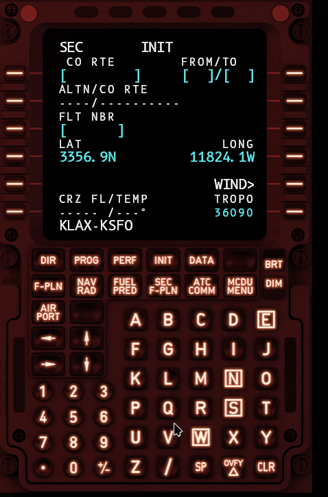

4. The route loads with departure and destination pre-populated.

   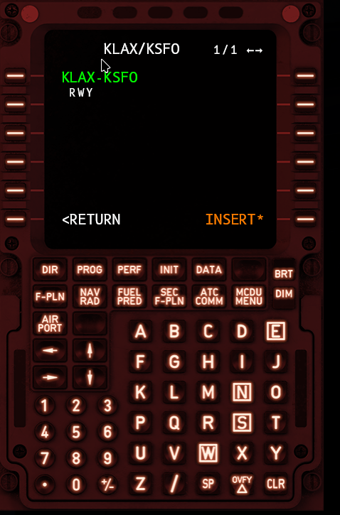

   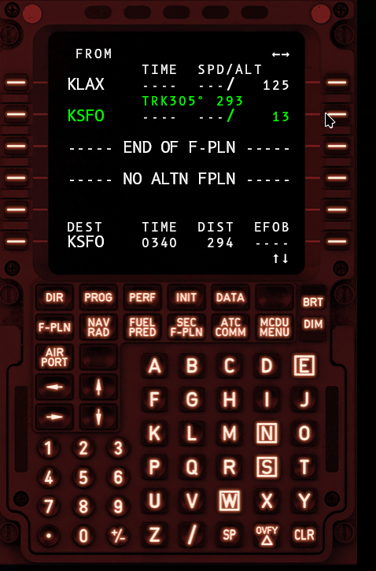

### Little NavMap

After exporting an `.lnmpln` file, open it in Little NavMap (**File → Open Flight Plan**):

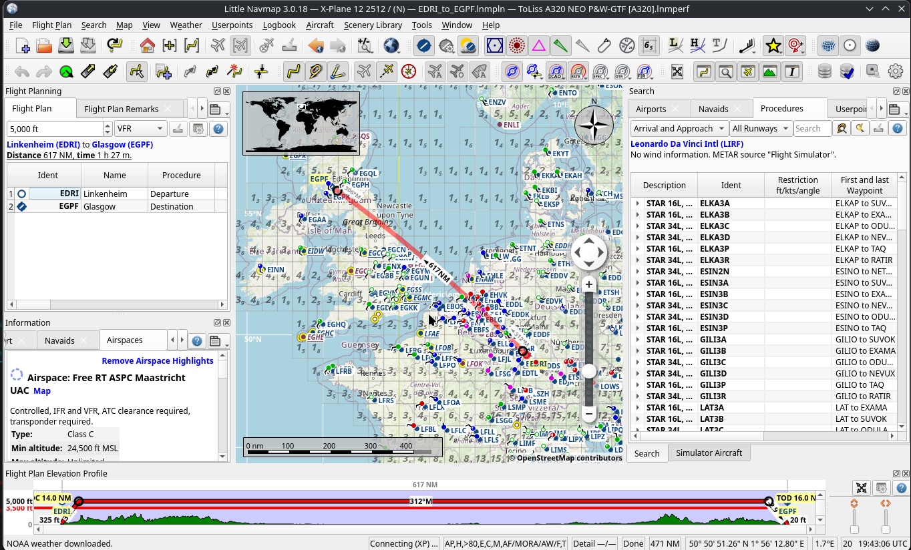

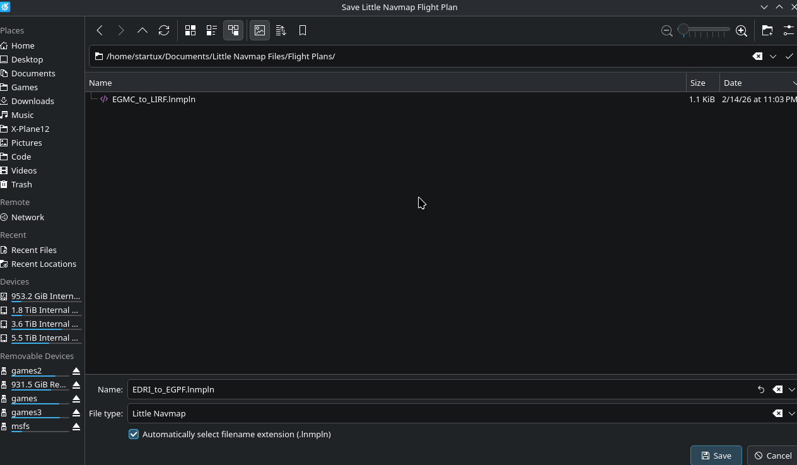

### SimBrief

Clicking **SimBrief** opens SimBrief's Generate Flight page in your browser, pre-populated with your origin, destination, and aircraft:

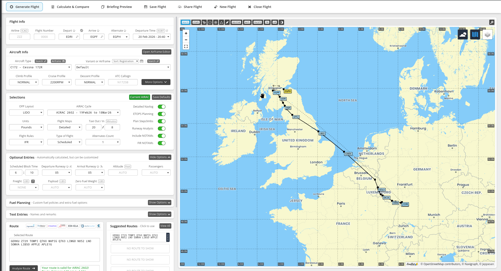

Complete the dispatch form and generate your OFP briefing as normal.

## History & Context

Click **History & Context** to open the Flight Context panel.

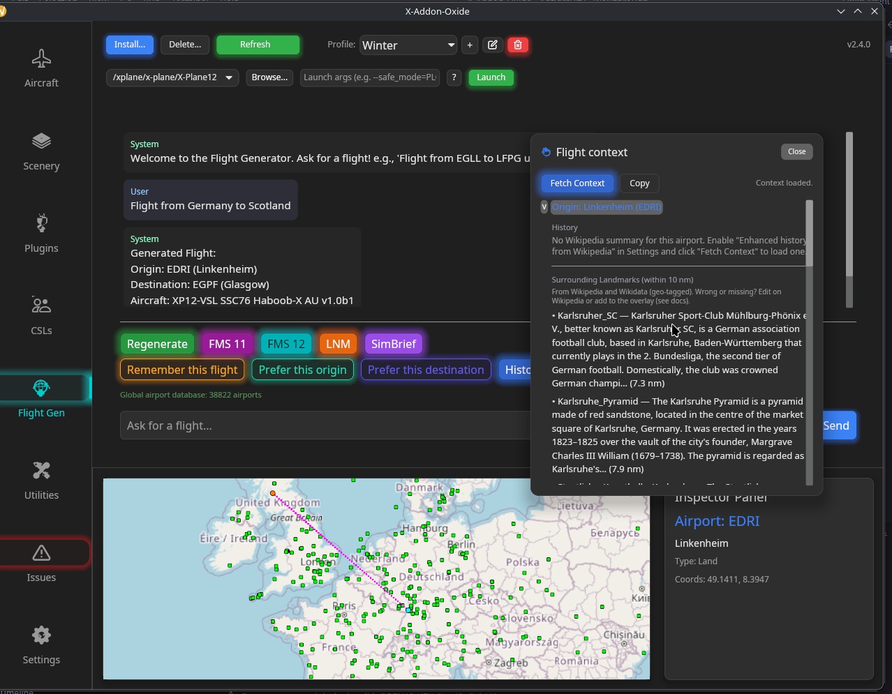

The panel shows:
* A **Wikipedia summary** for the origin airport and surrounding area (fetched live or from local cache).
* Points of interest within range.
* **Remember this flight** — persists this origin/destination pair as a preference. Future prompts for the same region are more likely to pick these airports.
* **Prefer this origin / destination** — marks the individual airport for higher priority in random selection.

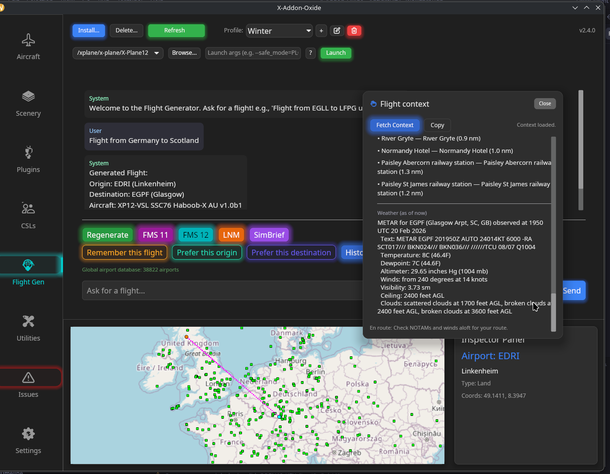

The METAR panel within History & Context shows the live weather report for your origin airport.

## Edit Dictionary (NLP Customisation)

The **Edit Dictionary** button opens the NLP JSON editor. This lets you teach the flight engine custom vocabulary for aircraft, weather, time, surface, flight type, and duration — without touching any code.

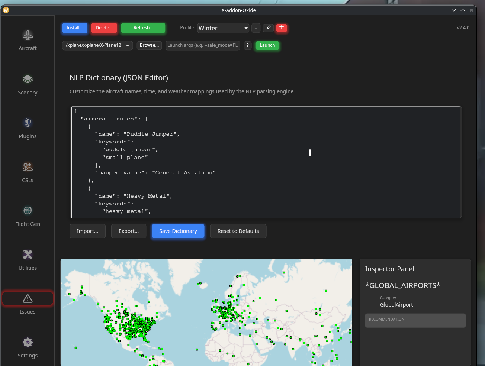

The dictionary supports six rule categories:

| Category | Controls |
|---|---|
| `aircraft_rules` | Maps phrases → aircraft tags; optionally sets distance limits and cruise speed |
| `time_rules` | Maps phrases → solar time-of-day windows (dawn/day/dusk/night) |
| `weather_rules` | Maps phrases → METAR weather conditions |
| `surface_rules` | Maps phrases → runway surface preference (soft/hard/water) |
| `flight_type_rules` | Maps phrases → flight type (bush/regional) |
| `duration_rules` | Maps phrases → distance envelopes (short/medium/long/haul) |

Each rule has a `priority` field — higher priority rules are matched first, so `"long haul"` at priority 1 always beats `"long"` at priority 0.

Click **▶ Valid Values Reference** inside the editor for an inline reference of all accepted `mapped_value` options for each category.

Use **Import** / **Export** to back up or share your dictionary. **Reset to Defaults** restores the factory vocabulary.

For the complete schema reference, see `docs/NLP_DICTIONARY.md` in the repository.

<div class="page-break"></div>

# Utilities

The **Utilities** tab contains the Companion Apps manager and your Pilot Logbook.

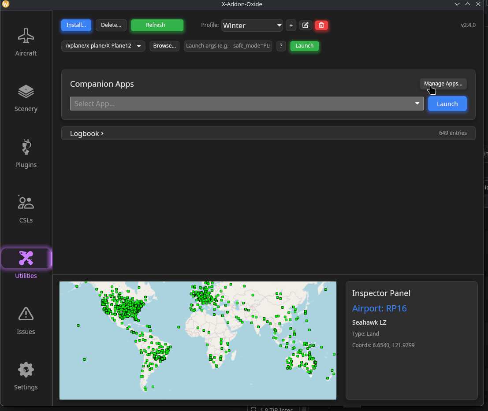

## Companion Apps

Launch your essential flight tools without switching windows.

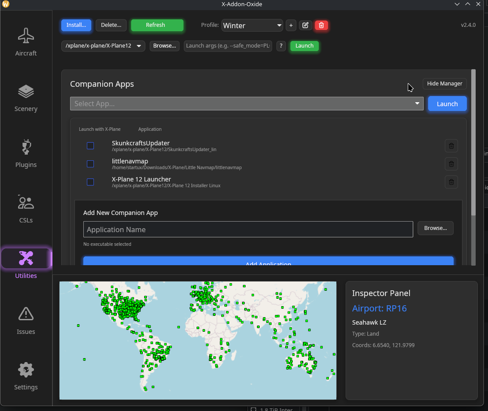

### Adding a Companion App

1. Click **Manage Apps…** to expand the manager.
2. Type a name in **Application Name**, then click **Browse…** to locate the executable.

   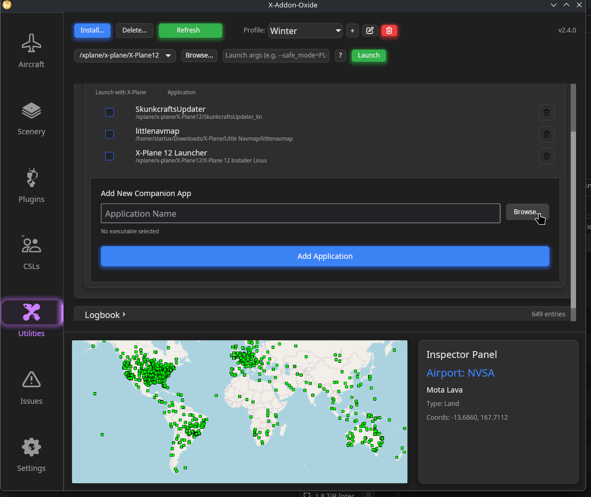

3. Click **Add Application**.

### Launching

* Select an app from the **Select App…** dropdown.
* Optionally check **Launch with X-Plane** to start it automatically when you click the main **Launch** button.
* Click **Launch** to start the app immediately.

### Launch X-Plane with Arguments

The **Launch args** field in the top toolbar passes command-line arguments directly to X-Plane:

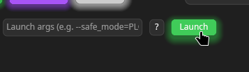

Common arguments:

| Argument | Effect |
|---|---|
| `--safe_mode=Plugin` | Disables all plugins on startup |
| `--fps_test=5` | Runs a 5-second FPS benchmark and exits |
| `--weather_seed=12345` | Forces a specific weather seed |

## Pilot Logbook

The Logbook section reads your X-Plane `Pilot.txt` file and presents all flights in a searchable, editable table.

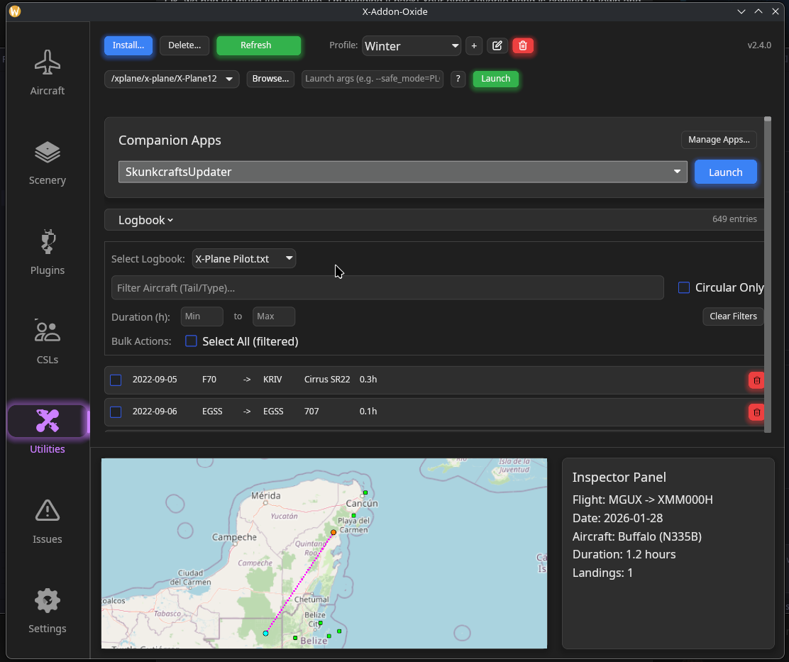

### Features

* **Search & Filter** — filter by tail number, aircraft type, airport ICAO, or date range.
* **Delete entries** — select one or multiple rows and delete them. A `.bak` backup is created automatically before any changes are written.
* **Show Route** — click any entry to plot the flight path on the world map.

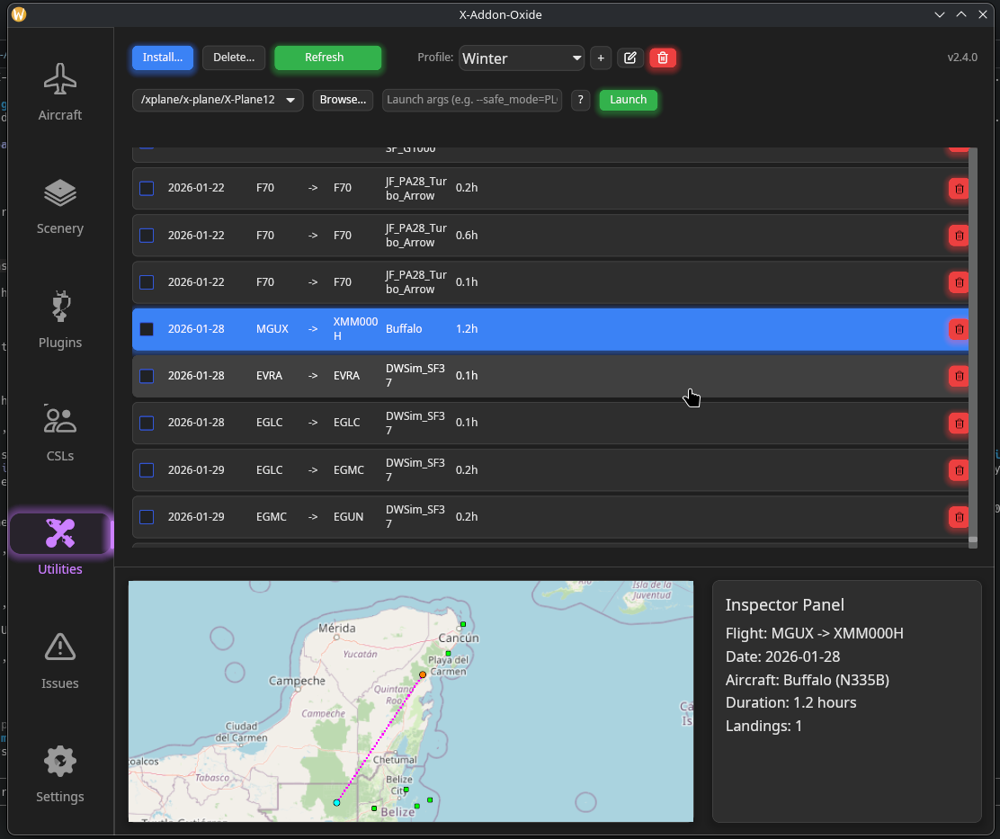

<div class="warning">
<strong>Warning:</strong> Logbook edits are permanent once saved. Always keep an external backup of your <code>Pilot.txt</code> file before bulk deletions.
</div>

<div class="page-break"></div>

# Issues Dashboard

The **Issues** tab scans your `X-Plane Log.txt` after a session and presents a structured error report — without requiring you to parse thousands of lines of log output manually.

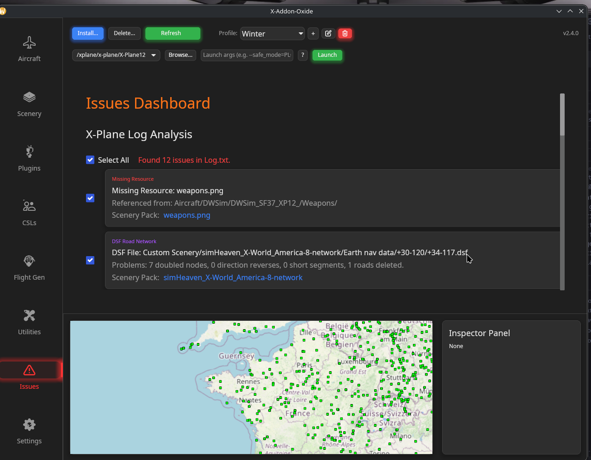

## Running a Scan

1. Fly a session in X-Plane (or reproduce the error you're investigating).
2. Close X-Plane or alt-tab to X-Addon-Oxide.
3. Open the **Issues** tab. Click **Select All** or check individual issue types.
4. Click **Scan** (or it auto-scans on first open).

## Understanding Results

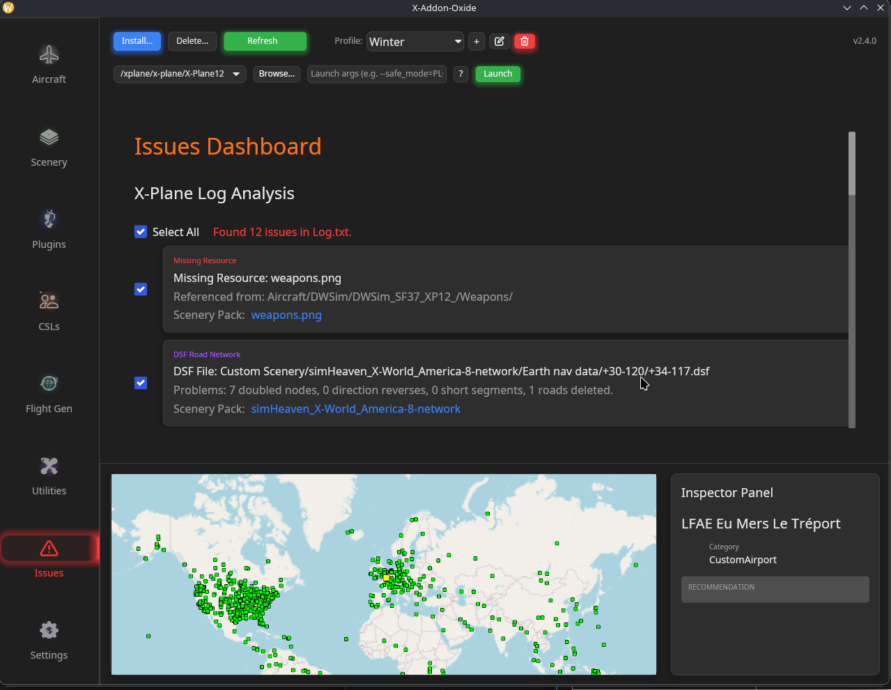

Each result shows:

| Field | Description |
|---|---|
| **Issue type** | e.g. "Missing Resource: weapons.png" or "DSF File parse error" |
| **Referenced from** | The source file that triggered the error (path to `.obj` or `.dsf`) |
| **Scenery Pack** | The installed pack responsible — this is the one to investigate or update |

## Scenery Order Validation

The Issues tab also runs a **Scenery Order Validation** check:

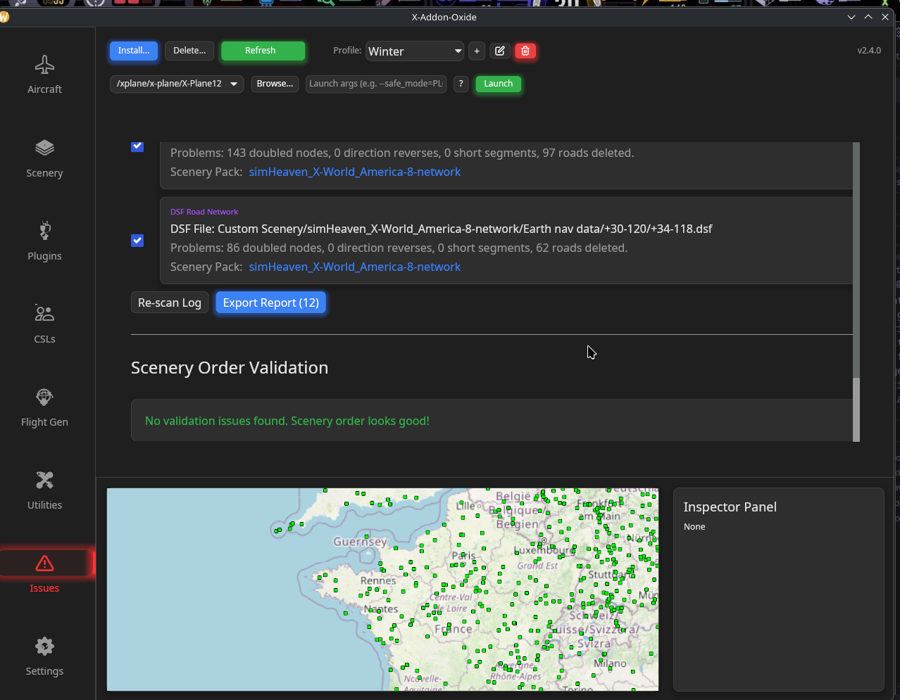

This checks whether your current `scenery_packs.ini` order violates known rules (e.g. SimHeaven above Global Airports). If violations are found, each is listed with the affected packs and a suggested fix.

## Export Report

Click **Export Report** to save all findings to a `.txt` or `.csv` file for sharing with addon developers or on support forums.

<div class="page-break"></div>

# Settings

The **Settings** tab controls application-wide scan and display behaviour.

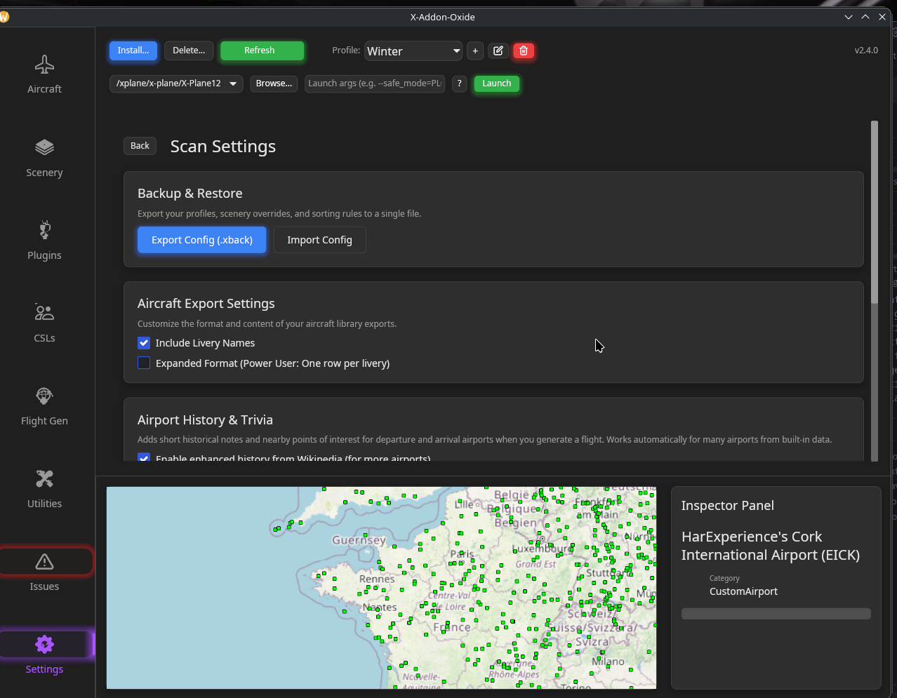
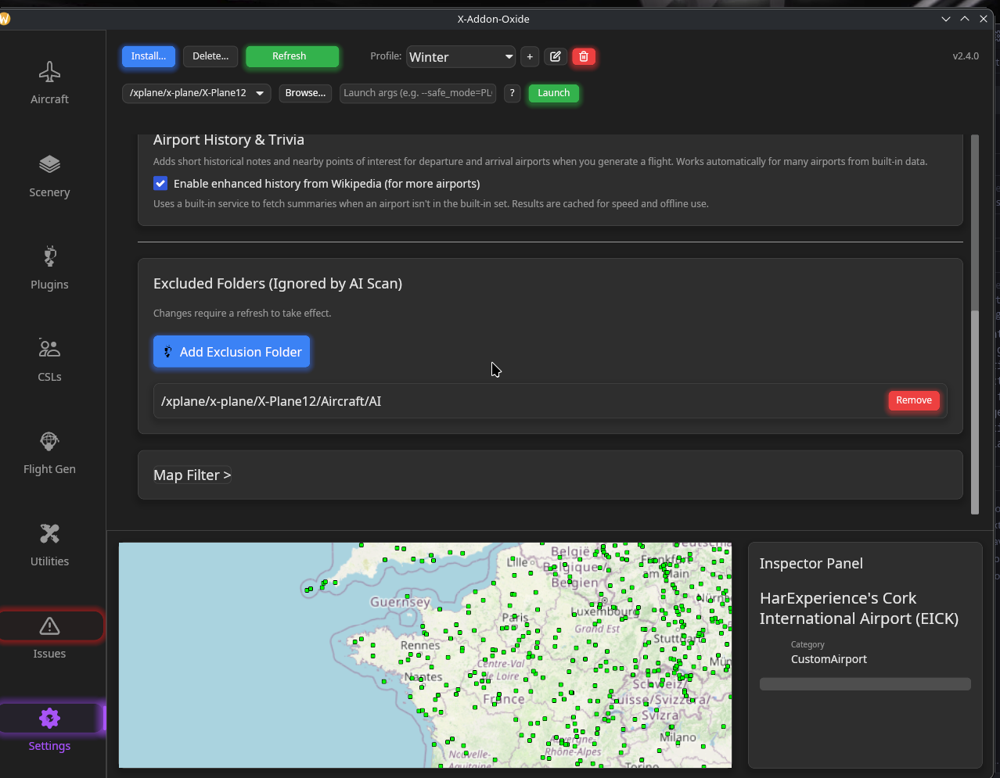

## Key Settings

| Setting | Description |
|---|---|
| **Exclude Paths** | Folders to skip during discovery — useful for large asset libraries you don't want listed |
| **Include Paths** | Additional folders outside your X-Plane root to include in scans |
| **Deep Scan** | Controls whether the background deep scan (airport/tile discovery) runs on startup |
| **AV Exclusion Tip** | Toggle the Windows Defender exclusion reminder banner |

<div class="page-break"></div>

# Troubleshooting

## Windows

### Slow Initial Scan / Loading Hangs

**Cause:** Windows Defender real-time protection scans each file as X-Addon-Oxide reads it. On libraries with thousands of airport folders this can take several minutes on first load.

**Fix:** Add your X-Plane folder and the X-Addon-Oxide data folder to Windows Defender exclusions:

1. Open **Windows Security** → **Virus & threat protection** → **Manage settings**.
2. Scroll to **Exclusions** → **Add or remove exclusions**.
3. Add these folders:
   - Your X-Plane root (e.g. `C:\X-Plane 12\`)
   - `%APPDATA%\X-Addon-Oxide\`

After adding exclusions, click **Refresh** in X-Addon-Oxide — subsequent loads will be significantly faster.

### App Won't Start / Missing DLL Error

Reinstall the Visual C++ Redistributable from [Microsoft's official page](https://learn.microsoft.com/en-us/cpp/windows/latest-supported-vc-redist). The X-Addon-Oxide installer bundles this, but it may have been removed by a system cleanup tool.

### scenery_packs.ini Not Updating

If X-Plane is running, it may have a lock on `scenery_packs.ini`. Exit X-Plane fully before making changes in X-Addon-Oxide, then click **Refresh**.

---

## macOS

### "X-Addon-Oxide is damaged and can't be opened"

This is a Gatekeeper quarantine issue, not actual damage.

```bash
xattr -cr /Applications/X-Addon-Oxide.app
```

Then launch normally.

### Permission Denied When Accessing X-Plane Folder

Go to **System Settings** → **Privacy & Security** → **Files and Folders** and grant X-Addon-Oxide access to your X-Plane drive or folder.

### Map Tiles Not Loading

macOS may block the map tile network requests. Check **System Settings** → **Privacy & Security** → **Network** and ensure X-Addon-Oxide has outbound network access.

---

## Linux

### App Fails to Start (Missing Libraries)

Run from a terminal to see the exact error:

```bash
./X-Addon-Oxide-x86_64.AppImage
```

If a library is missing (e.g. `libgtk-3.so.0`), install it using your package manager (see [System Requirements → Linux](#linux)).

### Display Issues on Wayland

If the UI appears blurry or has scaling issues on a HiDPI Wayland session, force X11 compatibility:

```bash
WAYLAND_DISPLAY="" ./X-Addon-Oxide-x86_64.AppImage
```

### Font Rendering Issues

Install `fontconfig` and rebuild the font cache:

```bash
sudo fc-cache -f -v
```

---

## All Platforms

### Scenery Not Showing After Changes

X-Addon-Oxide writes changes to `scenery_packs.ini` immediately, but X-Plane only reads this file at startup. **You must restart X-Plane** for any scenery changes to take effect.

### Wrong Scenery Order After Manual INI Edit

If you edited `scenery_packs.ini` in a text editor while X-Addon-Oxide was open, click **Refresh** to reload the current file state before making further changes.

### Flight Generator Produces No Results

* Ensure you have a working internet connection (required for METAR weather filtering).
* If your prompt includes very specific weather (e.g. `snow`) in a region where it is currently summer, try a broader prompt or remove the weather constraint.
* For seaplane prompts, ensure you have seaplane-base scenery installed or results will fall back to the global seed airports.

### Log Files

X-Addon-Oxide logs its own activity to:

| Platform | Path |
|---|---|
| **Windows** | `%APPDATA%\x-adox\X-Addon-Oxide\x-adox.log` |
| **macOS** | `~/Library/Application Support/com.x-adox.X-Addon-Oxide/x-adox.log` |
| **Linux** | `~/.config/x-adox/X-Addon-Oxide/x-adox.log` |

If reporting a bug, please include the contents of this file along with your operating system version, X-Plane version, and a description of what you were doing when the issue occurred.

---

*X-Addon-Oxide v2.4.0 · User Manual · February 2026*
